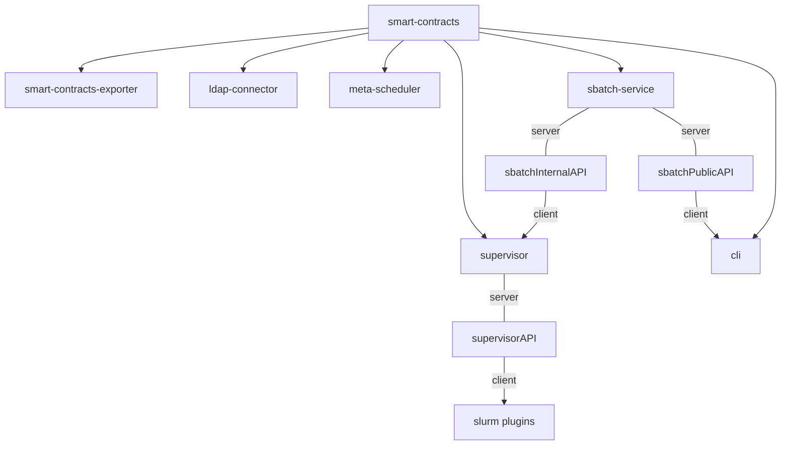

# Dependency tree

**Specifications**:

- Smart-contracts ABI
- sbatchInternalAPI (Protobuf)
- sbatchPublicAPI (GraphQL schema)
- supervisorAPI (Protobuf)

This tree indicates the propagation of changes.

For examples:

- If the smart-contracts changes, the 6 children of the smart-contracts will need to update but maybe not for the slurm plugins.
- If the supervisorAPI changes, the supervisor and slurm plugins will need to update.

# Compatibility Matrix

| smart-contracts                                              | meta-scheduler    | supervisor          | sbatch-service     | smart-contracts-exporter | ldap-connector (provider) | slurm plugins (provider) | cli (user)                       |
| ------------------------------------------------------------ | ----------------- | ------------------- | ------------------ | ------------------------ | ------------------------- | ------------------------ | -------------------------------- |
| [v1.0.2](https://github.com/deepsquare-io/grid/releases/tag/smart-contracts%2Fv1.0.2) | >=v0.3.1, <v0.4.0 | >=v0.12.3, <v0.13.0 | >=v0.11.0,<v0.14.0 | >=v0.3.2, <v0.4.0        | >=v1.2.3, <v1.3.0         | >=v1.3.0,<v1.4.0         | >=v1.0.0-alpha.5, <v1.0.0-beta.5 |
| [v1.1.0](https://github.com/deepsquare-io/grid/releases/tag/smart-contracts%2Fv1.1.0) | >=v0.4.0, <v0.5.0 | >=v0.14.0,<0.15.0   | >=v0.12.0,<v0.14.0 | >=v0.4.0,<v0.5.0         | >=v1.3.0,<v1.4.0          | >=v1.5.1                 | >=v1.0.0,<v1.2.0                 |
| [v1.2.0](https://github.com/deepsquare-io/grid/releases/tag/smart-contracts%2Fv1.2.0) | >=v0.5.0          | >=v0.16.0           | >=v0.15.0          | >=v0.5.0                 | >=v1.4.0                  | >=v1.5.1                 | >=v1.2.0                         |
