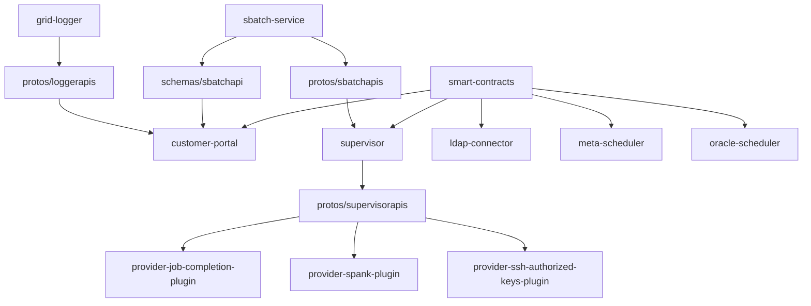

# The DeepSquare Grid

A decentralized network of compute resources.

## Monorepo dependency tree

## What is the DeepSquare Grid

TODO

## Why use the DeepSquare Grid

TODO

## Upgrade the smart-contracts

Go to the [Smart Contracts CI page](https://github.com/deepsquare-io/the-grid/actions/workflows/smart-contracts.yaml), and run the workflow with the Release flag checked and Initial Deploy unchecked.

## Documentation

TODO
