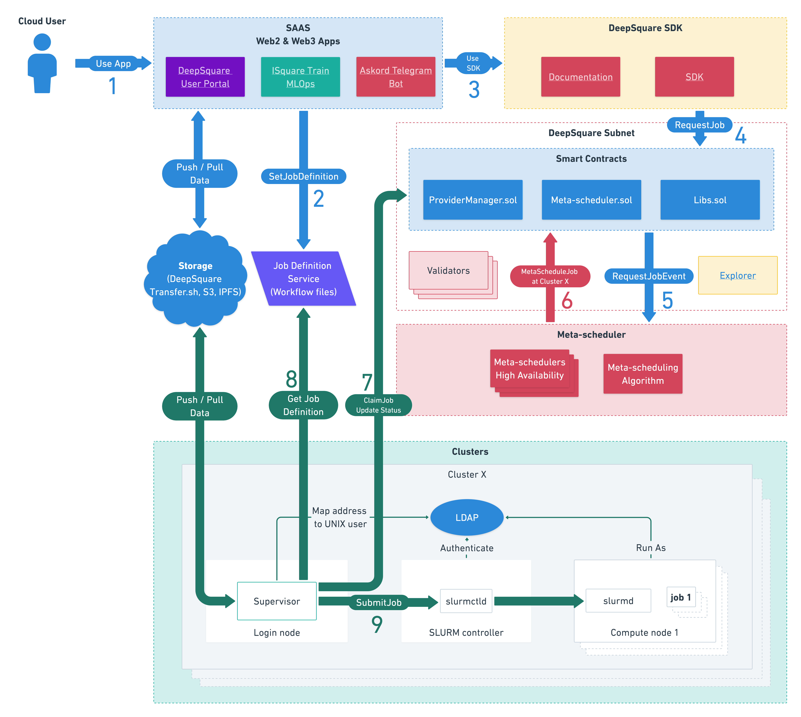

# The Architecture

## The Global Architecture

DeepSquare's global architecture is composed of three layers:

- The User Applications
- The Meta-Scheduler Smart-Contracts
- The Clusters



See [Workflow - Scheduling Architecture](/workflow/learn/architecture) for more information.

To avoid repetition with the other documentation, we will focus on the internals of the clusters.

## The Cluster Architecture


As you can see, there are many elements, so let's start slowly. We will simply the architecture by roles so that you understand their connections:

- The scheduling components
- The authentication components
- The storage and applications

### Simplification: The Scheduling components

<center>


</center>

#### The supervisor

First and foremost, the **supervisor** stands as the central component that serves as the **vital link between DeepSquare and your infrastructure**. Its role involves interfacing with the **Job Definition Service (also referred to as sbatch service)** and **SLURM**.

For those looking to adjust the cluster's **capacity** or tweak **pricing**, the supervisor is the component to configure. Additionally, **benchmarks** are initiated from the supervisor, and its results are submitted to the Meta-Scheduler, facilitating the classification of your cluster.

It's worth noting that the supervisor is the key **reward-generating component**, akin to a cryptocurrency miner or validator. Given its central role, ensuring the stability of this component is crucial to prevent system crashes.

#### The SLURM scheduler

SLURM is a job scheduling and resource management software. To understand its need, think of these questions:

- "How do I send multiple processes on multiple clusters and monitor them?"
- "How do I limit the resources the launched processes to allow a fair scheduling?"

To answer the first question, usually, you could simply use SSH to launch multiple processes:

```shell title="client"
# Copy program
scp root@node1 program .
scp root@node2 program .
scp root@node3 program .
# Execute program
ssh root@node1 ./program &
ssh root@node2 ./program &
ssh root@node3 ./program &
```

To simplify, you could use the `pssh` utility to do a parallel SSH, and use a shared storage to share the program:

```shell title="client"
# Copy program on the Network File System
scp root@node1 program /nfs/program
# Execute program
cat << EOF > ./hostfile
root@node1
root@node2
root@node3
EOF
pssh -h ./hostfile /nfs/program
```

Well, SLURM is similar. The SLURM Daemon replaces the SSH Server and the `pssh` utility is `sbatch`.

However, SLURM adds more features to make it friendly to run in a HPC infrastructure:

- Scheduling and Queues: Jobs are ordered and follows a scheduling algorithm.
- MPI friendly: Jobs are given additional environment variables so that it is easy to use MPI (_task ID_, _CPU binding_).

Because of that, we need a service that processes requests: the **SLURM controller**.

Now, about the second question, Linux has a neat feature called **cgroups** (control groups) which limit resource usage per process. The SLURM Daemon and SLURM Controller uses the resource allocation information and cgroups to limit and track the resources of the processes.

The architecture is used on any multi-node job scheduling, like Kubernetes with the Kubernetes scheduler and the kubelets.

Lastly, let's talk about the **SLURM Login** and **SLURM DB**. Technically, these are not needed:

- The SLURM Login contain an SSH server, which is used by the Supervisor to take control of the SLURM Login and authenticate users.
- The SLURM DB interfaces the SLURM controller and MariaDB for accounting.

**If you don't need accounting, you can safely remove the SLURM DB.**

Right now, the supervisor is not able to do **SSH-less** commands, though, it may be planned in the future to avoid installing the SLURM login.

#### The Provider SLURM plugins (SPANK and controller)

The Provider SLURM SPANK plugin is integrated into the compute node as a plugin for the SLURM Daemon. Its primary function is to relay the status of jobs to the Meta-Scheduler. As this plugin is deployed on the compute node, it doesn't disclose any sensitive information and has no impact on billing (compute nodes can fail).

Instead, we use the Provider SLURM Job Completion plugin. Installed on the SLURM controller, this plugin reports the ultimate state of jobs and their duration. This component is pivotal for accurate billing, as it is responsible for reporting the actual cost incurred by a job.

---

Now that you know about the scheduling components, let's talk about the authentication components.

### Simplification: The Scheduling components


#### The Authentication on SLURM

SLURM uses Linux users to allow launching job on SLURM. By default, everyone is authorized to launch jobs. However, workspaces (home directory) must be separated to avoid any security failure, which is why we are using a **Linux user per Ethereum Address**.

In the future, we aim to remove the need to use a Linux user to launch jobs.

Because, we need a **Linux user**, we need to synchronize this user on every SLURM components: Login, Controller and Daemon. To do that, we use **389ds (LDAP)** and **SSSD**.

#### LDAP as Identity Provider for Linux

**389ds** is an Identity Provider, but also an Active Directory. This stores users and information needed for SSSD.

**SSSD** is a daemon that converts **LDAP users** into **Linux users**. More precisely, SSSD is a PAM ([Pluggable Authentication Modules](https://en.wikipedia.org/wiki/Pluggable_authentication_module)), which changes the behavior of the login process on a Linux distribution.

In the future, we also hope to develop our own PAM plugin to avoid SSSD and just synchronize Web3 users. In the meantime, we use the **LDAP connector.**

#### The LDAP connector

The **LDAP connector** reads the Meta-Scheduler smart-contracts and detects new user. When a Web3 user submits a job, this Web3 user is converted into an LDAP user.

### The "rest"

#### CVMFS replica

Firstly, this replica may not be needed. If you don't want to replicate the remote CVMFS, you can connect the CVMFS client directly to ours.

CVMFS, or CernVM-FS, is a globally distributed network file system with aggressive caching. It is used to **share software across networks**. We use CVMFS to **share containers across the network**.

Thanks to its aggressive caching, loading a container from CVMFS is **blazingly fast**.

#### Traefik

Traefik is just a reverse proxy, like NGINX. This is used to expose services behind HTTPS internally.

#### The Network Shared Storage

If read above, the Network Shared Storage has multiple purposes:

- A **shared working directory**: users will work on this directory and program will be exported to the compute nodes automatically.
- A **cache**: heavy ML models, the outputs of the jobs, or anything will be stored on this storage.
- A **parallel file-system**: If users uses MPI, a parallel file-system will accelerate reads and writes across the network.

## Conclusion

Now, that you've learned about the architecture. It is time to [learn about customizing the supervisor for your needs](/deepsquare-grid/learn/supervisor)!
