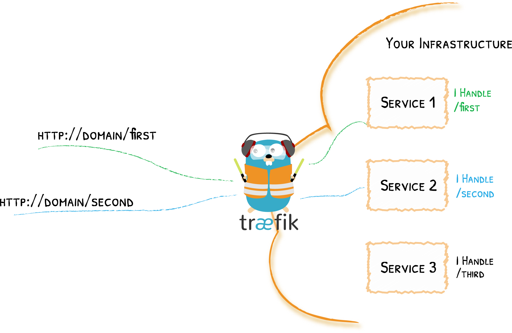

# Deploying ClusterFactory

## Overview

Assuming the infrastructure look like this:

<div style={{textAlign: 'center'}}>


</div>

## 1. Setup the repository for GitOps

### a. Create a private fork

We will create a private fork.

1. Create a [bare](https://git-scm.com/docs/git-clone#Documentation/git-clone.txt---bare) clone of the ClusterFactory repository.

   ```shell title="user@local:/"
   git clone --bare https://github.com/deepsquare-io/ClusterFactory.git
   ```

2. Create [a new private repository on your favorite Git hosting website](https://docs.github.com/en/repositories/creating-and-managing-repositories/creating-a-new-repository) and name it `ClusterFactory`. This repository will be tracked by ArgoCD and will represent the state of your infrastructure.

3. [Mirror-push](https://git-scm.com/docs/git-clone#Documentation/git-clone.txt---mirror) your bare clone to **your** new `ClusterFactory` repository.

   ```shell title="user@local:/"
   cd ClusterFactory.git
   # SSH
   git push --mirror git@github.com:<your account>/ClusterFactory.git
   ```

   You've pushed a copy of ClusterFactory to you repository.

4. Remove the bare clone since we don't need it anymore.

   ```shell title="user@local:/ClusterFactory.git"
   cd ..
   rm -rf ./ClusterFactory.git

   ```

5. You can now clone **your** `ClusterFactory` repository on your machine.

   ```shell title="user@local:/"
   # SSH
   git clone git@github.com:<your account>/ClusterFactory.git
   ```

### b. Track the upstream remote repository

Git is capable of managing multiple remote repositories. By default, `origin` is linked to the `<your account>/ClusterFactory` repository. To be able to fetch updates from the upstream `deepsquare-io/ClusterFactory` repository, we need to add a remote repository that we call `upstream`.

1. Add the upstream and disable push on the remote `upstream`:

   ```shell title="user@local:/ClusterFactory"
   git remote add upstream https://github.com/deepsquare-io/ClusterFactory.git
   git remote set-url --push upstream DISABLE
   ```

2. You can list all your remotes with `git remote -v`:

   ```shell title="user@local:/ClusterFactory"
   git remote -v
   # origin	git@github.com:<your account>/ClusterFactory.git (fetch)
   # origin	git@github.com:<your account>/ClusterFactory.git (push)
   # upstream	https://github.com/deepsquare-io/ClusterFactory.git (fetch)
   # upstream	DISABLE (push)
   ```

You can then update your repository from the upstream repository by doing:

```shell title="user@local:/ClusterFactory"
git fetch upstream
git merge upstream/main
```

### c. (Optional) Checkout to a stable version and create a new branch

You can checkout to a stable version:

```shell title="user@local:/ClusterFactory"
git checkout -b configs <CF version>
```

:::caution

Please note that ClusterFactory is under heavy development, it is strongly recommended to follow the latest version of ClusterFactory.

Unannounced breaking changes are to be expected.

:::

### d. Rename the examples and commit

Copy `argo.example`, `core.example`, `cfctl.yaml.example`, and remove the `.example`:

```shell title="user@local:/ClusterFactory"
cp -R argo.example/ argo/
cp -R core.example/ core/
cp cfctl.yaml.example cfctl.yaml
```

You can track these files on Git:

```shell title="user@local:/ClusterFactory"
git add .
git commit -m "Initialized my config"
```

## 2. Configure and deploy with cfctl

The documentation for this section is [here](https://docs.clusterfactory.io/docs/reference/cfctl.yaml). Edit the cfctl.yaml file:

1. Provide each host a valid IP address that is reachable by cfctl, and the connection details for an SSH connection. You can also change the `labels` to match with your region and zone.

   ```yaml title="ctctl.yaml"
   apiVersion: cfctl.clusterfactory.io/v1beta1
   kind: Cluster
   metadata:
     name: k8s.example.com-cluster
   spec:
     hosts:
       - ssh:
           address: 192.168.0.2
           user: root
           port: 22
           keyPath: ~/.ssh/id_ed25519
         role: controller+worker
         noTaints: true
         privateInterface: eno1
         privateAddress: 192.168.0.2
         installFlags:
           - --debug
           - --labels="topology.kubernetes.io/region=ch-sion,topology.kubernetes.io/zone=ch-sion-1"
           - --disable-components coredns
         hooks:
           apply:
             before:
               # Set SELinux Permissive
               - sh -c 'if [ "$(getenforce)" != "Permissive" ] && [ "$(getenforce)" != "Disabled" ]; then sed -i s/^SELINUX=.*$/SELINUX=permissive/ /etc/selinux/config; fi'
               - sh -c 'if [ "$(getenforce)" != "Permissive" ] && [ "$(getenforce)" != "Disabled" ]; then setenforce 0; fi'
   ```

2. Change the Cluster configuration. Most of the settings are already correct, so just change the `name` of the cluster.

   ```yaml title="ctctl.yaml"
   spec:
     # ...
     k0s:
       version: '1.27.1+k0s.0'
       dynamicConfig: false
       config:
         apiVersion: k0s.k0sproject.io/v1beta1
         kind: ClusterConfig
         metadata:
           name: k8s.example.com
         spec:
           api:
             k0sApiPort: 9443
             port: 6443
           installConfig:
             users:
               etcdUser: etcd
               kineUser: kube-apiserver
               konnectivityUser: konnectivity-server
               kubeAPIserverUser: kube-apiserver
               kubeSchedulerUser: kube-scheduler
           konnectivity:
             adminPort: 8133
             agentPort: 8132
           network:
             calico:
               mode: 'vxlan'
               overlay: Always
               mtu: 0
               wireguard: false
             kubeProxy:
               disabled: false
               mode: iptables
             kuberouter:
               autoMTU: true
               mtu: 0
               peerRouterASNs: ''
               peerRouterIPs: ''
             podCIDR: 10.244.0.0/16
             provider: calico
             serviceCIDR: 10.96.0.0/12
           podSecurityPolicy:
             defaultPolicy: 00-k0s-privileged
           storage:
             type: etcd
           telemetry:
             enabled: false
   ```

3. Deploy:

   ```shell title="user@local:/ClusterFactory"
   . ./scripts/setup-env # This download all the necessary utilities

   cfctl apply --debug
   ```

4. Fetch the kubeconfig and load it:

   ```shell title="user@local:/ClusterFactory"
   cfctl kubeconfig --config ./cfctl.yaml >./kubeconfig
   chmod 600 ./kubeconfig
   export KUBECONFIG=$(pwd)/kubeconfig
   ```

You will need to `export KUBECONFIG=$(pwd)/kubeconfig` each time you open a new terminal, or you can add the config to you `~/.kube/config`.

## 3. Configure and deploy the core

### a. Configure MetalLB

**MetalLB is the IP advertizer for the LoadBalancer services. It attaches IP to the Kubernetes LoadBalancer services and announce it to the whole network and router.**

<div style={{textAlign: 'center' }}>


</div>

For the sake of simplicity, we will use the **ARP (L2) method**. Do note that **BGP (L3) method** offers a true [Load-Balancing behavior](https://metallb.universe.tf/concepts/bgp/). You can follow [this guide to deploy with BGP](https://docs.clusterfactory.io/docs/getting-started/core-apps-deployment#multi-zone-bgp).

1. Configure the IPs to be advertized. Edit the `IPAddressPool` in the file `core/metallb/address-pools.yaml`:

   ```yaml title="core/metallb/address-pools.yaml"
   apiVersion: metallb.io/v1beta1
   kind: IPAddressPool
   metadata:
     name: main-pool
     namespace: metallb
   spec:
     addresses:
       - 192.168.0.100/32
   ```

2. Configure MetalLB to use ARP (L2) to advertize the IP:

   ```yaml title="core/metallb/address-pools.yaml"
   apiVersion: metallb.io/v1beta1
   kind: L2Advertisement
   metadata:
     name: l2-advertisement
     namespace: metallb
   spec:
     ipAddressPools:
       - main-pool
   ```

Notice that `addresses` is inside our `192.168.0.0/24` subnet. This is so that we don't need to create a route from the router. If you want to use an IP outside this range, use BGP or L2 with a static route.

### b. Configure Traefik

**Traefik is the main L7 load balancer and entrypoint. HTTP, TCP and UDP traffic will go through here and will be routed to the right Kubernetes Services based on rules.**

<div style={{textAlign: 'center'}}>



</div>

1. Edit the `core/traefik/values.yaml` file. Attach the MetalLB IP to traefik by adding the annotations:

   ```yaml title="core/traefik/values.yaml"
   service:
     enabled: true
     annotations:
       metallb.universe.tf/address-pool: main-pool
       metallb.universe.tf/allow-shared-ip: traefik-lb-key
     spec:
       externalTrafficPolicy: Cluster # Load Balance horizontally via MetalLB too
   ```

2. Add the following ports:

   ```yaml title="core/traefik/values.yaml"
   ports:
     traefik:
       port: 9000
       expose: true
       exposedPort: 9000
       protocol: TCP
     dns-tcp:
       port: 8053
       expose: true
       exposedPort: 53
       protocol: TCP
     dns-udp:
       port: 8054
       expose: true
       exposedPort: 53
       protocol: UDP
     ldap:
       port: 389
       expose: true
       exposedPort: 389
       protocol: TCP
     ldaps:
       port: 636
       expose: true
       exposedPort: 636
       protocol: TCP
     web:
       port: 80
       expose: true
       exposedPort: 80
       protocol: TCP
     websecure:
       port: 443
       expose: true
       exposedPort: 443
       protocol: TCP
       # You MUST open port 443 UDP!
       # HTTP3 upgrades the connection from TCP to UDP.
       http3:
         enabled: true
       tls:
         enabled: true
     metrics:
       port: 9100
       expose: false
       exposedPort: 9100
       protocol: TCP
   ```

Traefik will expose the LDAP ports, HTTP ports and DNS ports.

### c. CoreDNS configuration

CoreDNS uses **hostPort**, meaning you can access to the DNS via either Traefik (192.168.0.100) or the Kubernetes nodes (192.168.0.2). **Make sure that the systemd-resolved sub listener is disabled. Open the `/etc/systemd/resolved.conf` configuration file on the Kubernetes hosts and disable the stub listener by setting `DNSStubListener` to `no`. Finally, restart the service with `systemctl restart systemd-resolved.service`.**

To configure CoreDNS, you have to look for these two files: `core/coredns/overlays/prod/configmap.yaml` and `core/coredns/overlays/prod/daemonset.yaml`.

Replace the examples of the `ConfigMap` with:

```yaml title="core/coredns/overlays/prod/configmap.yaml"
apiVersion: v1
kind: ConfigMap
metadata:
  name: coredns
  namespace: kube-system
  labels:
    k0s.k0sproject.io/stack: coredns
data:
  Corefile: |
    .:53 {
      errors
      health {
        lameduck 5s
      }
      ready
      kubernetes cluster.local in-addr.arpa ip6.arpa {
        pods insecure
        fallthrough in-addr.arpa ip6.arpa
        ttl 30
      }
      prometheus :9153
      forward . 8.8.8.8
      cache 30
      loop
      reload
      loadbalance
      }
      internal:53 {
        log
        errors
        ready
        hosts /etc/coredns/internal.db
        reload
      }
      example.com:53 {
        log
        errors
        ready
        hosts /etc/coredns/example.com.db
        reload
      }

  internal.db: |
    192.168.0.100 traefik.internal
    192.168.0.100 argocd.internal

  example.com.db: |
    192.168.0.100 ldap.example.com
    192.168.0.100 cvmfs.example.com
    192.168.0.100 ipmi.example.com
    192.168.0.100 supervisor.example.com

    192.168.0.2 mn1.example.com
    # The slurm controller is using hostPort
    192.168.0.2 slurm-cluster-satoshi-1-controller-0.example.com
    192.168.0.3 grendel.example.com

    192.168.0.51 cn1.example.com
```

Our routes for external-to-pod communications will look like this:

<div style={{textAlign: 'center'}}>


</div>

If you plan to rename `example.com.db` into your `your.domain.db`, don't forget to change the `daemonset.yaml` too:

```diff title="core/coredns/overlays/prod/daemonset.yaml > spec > template > spec > volumes"
        volumes:
          - name: config-volume
            configMap:
              name: coredns
              items:
                - key: Corefile
                  path: Corefile
-               - key: example.com.db
-                 path: example.com.db
                - key: internal.db
                  path: internal.db
+               - key: your.domain.db
+                 path: your.domain.db
              defaultMode: 420
```

Modify the zones with your own custom ones and update the `forward` field with your preferred DNS.

### d. Configure the cert-manager issuers

We are going to use our own Certificate Authority (CA) for all of our services.

1. Create a Secret `ca-key-pair`. To generate a TLS certificate and its private key:

   ```shell
   openssl genrsa -out tls.key 2048
   openssl req -x509 -sha256 -new -nodes -key tls.key -days 3650 -out tls.crt
   kubectl create secret tls ca-key-pair -n cert-manager --cert=tls.crt --key=tls.key
   rm ca-key-pair-secret.yaml
   ```

2. Then, create a private ClusterIssuer:

   ```yaml title="core/cert-manager/private-cluster-issuer.yaml"
   apiVersion: cert-manager.io/v1
   kind: ClusterIssuer
   metadata:
     name: private-cluster-issuer
     namespace: cert-manager
   spec:
     ca:
       secretName: ca-key-pair
   ```

3. Edit the production ClusterIssuer if you want to expose Kubernetes Services to the Internet with TLS:

   ```yaml title="core/cert-manager/production-cluster-issuer.yaml"
   apiVersion: cert-manager.io/v1
   kind: ClusterIssuer
   metadata:
     name: production-cluster-issuer
     namespace: cert-manager
   spec:
     acme:
       email: john.smith@example.com
       server: https://acme-staging-v02.api.letsencrypt.org/directory
       privateKeySecretRef:
         name: production-cluster-issuer-account-key
       solvers:
         - http01:
             ingress:
               class: traefik
   ```

The production ClusterIssuer will contact the ACME servers to generate public TLS certificates on trusted root CA servers.

### e. (Optional) Configure the ArgoCD certificate

You can configure the ArgoCD certificate by editing the `core/argo-cd/certificate.yaml` file:

```yaml title="core/argo-cd/certificate.yaml"
apiVersion: cert-manager.io/v1
kind: Certificate
metadata:
  name: argocd.internal-cert
  namespace: argocd
spec:
  secretName: argocd.internal-secret
  issuerRef:
    name: selfsigned-cluster-issuer
    kind: ClusterIssuer
  commonName: argocd.internal
  duration: 43800h
  subject:
    countries: [CH]
    localities: [Lonay]
    organizationalUnits: []
    organizations: [Example Org]
    postalCodes: ['1027']
    provinces: [Laud]
    streetAddresses: [Chemin des Mouettes 1]
  dnsNames:
    - argocd.internal
  emailAddresses:
    - john.smith@example.com
  privateKey:
    size: 4096
    algorithm: RSA
```

### f. Deploy the core

Run the `./scripts/deploy-core` script:

```shell title="user@local:/ClusterFactory"
. ./scripts/setup-env # This download all the necessary utilities
export KUBECONFIG=$(pwd)/kubeconfig
./scripts/deploy-core
```

Don't hesitate to run it again if it crashes. This won't and will never harm the cluster.

This should deploy:

- Traefik
- CoreDNS
- MetalLB
- MultusCNI
- sealed-secrets
- cert-manager
- ArgoCD

If CoreDNS and the IngressRoutes are configured, you should be able to access the ArgoCD dashboard and Traefik dashboard via `traefik.internal` and `argocd.internal`, and by changing your DNS configuration to either `192.168.0.100` (Traefik) or `192.168.0.2` (Kubernetes Node).

On Linux, you should change the `/etc/resolv.conf`, like so:

```shell title="/etc/resolv.conf"
search example.com
nameserver 192.168.0.2
```

## What's next

We've deployed a Kubernetes "Cluster"! To join the grid, you must deploy our software stack. This includes:

- 389ds
- The DeepSquare Provider LDAP connector
- MariaDB
- The SLURM cluster (login, controller and database)
- CVMFS Stratum 1
- The DeepSquare Supervisor
- Grendel


