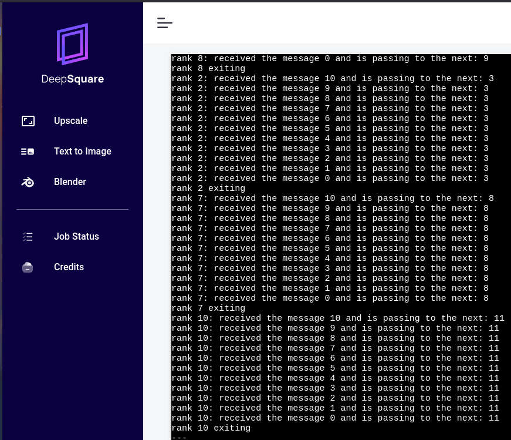

# Writing a workflow file

You containerized the MPI example application. In this part, you will now run it on the DeepSquare GRID.

A workflow file is a [JSON](https://developer.mozilla.org/en-US/docs/Web/JavaScript/Reference/Global_Objects/JSON) file that describes the resources allocation and the suite of instructions necessary to run your application.

## Understanding the workflow format

We recommend to use the [DeepSquare sandbox page](https://app.deepsquare.run/sandbox) to write workflow file and the [reference API](/docs/deploy-deepsquare/workflow-api-reference/job).

The sandbox should be filled with:

```json
{
  "resources": {
    "tasks": 1,
    "gpusPerTask": 0,
    "cpusPerTask": 1,
    "memPerCpu": 1024
  },
  "enableLogging": true,
  "steps": [
    {
      "name": "hello world",
      "run": {
        "command": "echo \"Hello World\""
      }
    }
  ]
}
```

## Writing the workflow file

We will use, 16 CPUs and 1024 MB of RAM per CPU.

We can map easily the "podman run" arguments to the workflow file. We have:

```json title="Workflow"
{
  "resources": {
    "tasks": 1,
    "gpusPerTask": 0,
    "cpusPerTask": 16,
    "memPerCpu": 1024
  },
  "enableLogging": true,
  "steps": [
    {
      "name": "run the circle program",
      "run": {
        "command": "mpirun -np 16 ./main",
        "workDir": "/app",
        "container": {
          "image": "deepsquare-io/mpi-example:latest",
          "registry": "ghcr.io"
        }
      }
    }
  ]
}
```

However, since our infrastructure already integrates OpenMPI using [PMIx](https://pmix.github.io/standard), there is no need to use `mpirun` and **the number of tasks replaces the number of processes**. So instead you should write :

```json title="Workflow"
{
  "resources": {
    "tasks": 16,
    "gpusPerTask": 0,
    "cpusPerTask": 1,
    "memPerCpu": 1024
  },
  "enableLogging": true,
  "steps": [
    {
      "name": "run the circle program",
      "run": {
        "command": "./main",
        "workDir": "/app",
        "resources": {
          "tasks": 16
        },
        "container": {
          "image": "deepsquare-io/mpi-example:latest",
          "registry": "ghcr.io"
        }
      }
    }
  ]
}
```

Notice the `tasks` and `cpusPerTask`. We specify the resource allocation using the `resources` block and use these resources during the steps.

The `.resources` block indicates the **allocation** but not the actual **use** by the step. Here, the execution of the step **implicitly uses** 16 CPUs per task, 1024 MB of memory per CPU, and no GPUs per task and **explicitly uses** 16 tasks. Default values for `.steps[].run.resources` are specified in the [reference](/docs/deploy-deepsquare/workflow-api-reference/job#stepsrunresources-steprunresources).

By enabling `enableLogging`, you allow the application to send logs to the DeepSquare logging system, which allows you to read the logs on the [DeepSquare GRID Portal](https://app.deepsquare.run).

You can launch it on DeepSquare to see the results!

<div style={{textAlign: 'center'}}>



</div>

:::note

You may see errors like :

```shell
--------------------------------------------------------------------------
WARNING: There was an error initializing an OpenFabrics device.

  Local host:   cn2
  Local device: mlx5_2
--------------------------------------------------------------------------
```

This is because we did not optimize the OpenMPI parameters. The `mlx*` devices are [Mellanox devices](https://www.nvidia.com/en-us/networking/) and prefer the [Unified Communication X (UCX)](https://openucx.org) point-to-point messaging layer (pml). We recommend this [tech talk](https://www.youtube.com/watch?v=C4XfxUoSYQs) for a better understanding. To tune OpenMPI, you can use environment variables like this:

```json title="Workflow"
{
  "resources": {
    "tasks": 16,
    "gpusPerTask": 0,
    "cpusPerTask": 1,
    "memPerCpu": 1024
  },
  "enableLogging": true,
  "env": [
    {
      "key": "OMPI_MCA_pml",
      "value": "ucx"
    },
    {
      "key": "OMPI_MCA_btl",
      "value": "^vader,tcp,openib,uct"
    }
  ],
  "steps": [
    {
      "name": "run the circle program",
      "run": {
        "command": "./main",
        "workDir": "/app",
        "resources": {
          "tasks": 16
        },
        "container": {
          "image": "deepsquare-io/mpi-example:latest",
          "registry": "ghcr.io"
        }
      }
    }
  ]
}
```

:::

## Next steps

You've learned how to launch workloads on the DeepSquare grid! We've done a simple fire-and-forget, but you may want to persist some data.

Data scientists often train their machine learning neural network models on HPCs and need to input training data and output model control points.

So you will learn how to send a dataset and get results.
