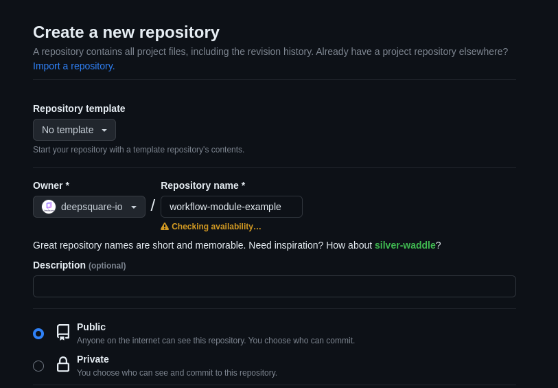

# Getting Started

Modules are reusable group of steps that can be shared between different workflows. They can help developers save time and reduce errors by automating common tasks and integrating with popular tools.

## About modules

The modular feature allows developers to discover and use pre-built custom group of steps that have been created and shared by other members of the community. These modules can be easily integrated into a workflow by simply referencing them in a "use" step. The community aspect of this feature means that developers can benefit from the collective expertise of other developers and find solutions to problems they may not have encountered before.

Example of usage:

```json title="Hello-world workflow"
{
  "enableLogging": false,
  "resources": {
    "tasks": 1,
    "cpusPerTask": 8,
    "memPerCpu": 8000,
    "gpusPerTask": 0
  },
  "steps": [
    {
      "name": "hello-world",
      "use": {
        "source": "github.com/deepsquare-io/workflow-module-example@v1",
        "args": [
          {
            "key": "WHO",
            "value": "me"
          }
        ],
        "exportEnvAs": "HELLO_WORLD"
      }
    },
    {
      "name": "repeat",
      "run": {
        "command": "echo ${HELLO_WORLD_RESULT}"
      }
    }
  ]
}
```

## Creating a module

Creating a module is quite easy:

1. Create a git repository on a public git hosting service. For this guide, let's create it on github:

   

2. Clone that repository.

   ```shell "user@~/"
   git clone git@github.com:deepsquare-io/workflow-module-example.git
   ```

3. At the root of the repository, create a `module.yaml` and fill it with your group of steps.

   ```yaml "module.yaml"
   name: 'Hello World'
   description: 'An example of module'
   inputs:
     - key: WHO
       description: 'Who to greet'
       default: 'World'
   outputs:
     - key: RESULT
       despcription: 'Resulting string'
   minimumResources:
     tasks: 1
     cpusPerTask: 1
     memPerCpu: 100
     gpusPerTask: 0
   steps:
     - name: "Say hello World"
       run:
         container:
           registry: registry-1.docker.io
           image: library/busybox:latest
         command: |
           echo "Running with {{ .Job.Resources.MemPerCPU }}M of memory"
           echo "Hello ${WHO}"
           echo "RESULT=Hello ${WHO}" >> ${DEEPSQUARE_ENV}
   ```

   You must describe:

   - The `name` of the module.
   - A module `description`.
   - The `minimumResources` which are the minimum requirements for your module to work as expected.
   - The `steps` which is the main body of the module.

   Optionally, you can describe:

   - expected `inputs` which the user of the module can use by adding a value to the `args` field of the [_StepUse_](/docs/deploy-deepsquare/workflow-api-reference/job#steprsuse-stepuse).
   - expected `outputs`, which can be exported if the user of the module specify the `exportEnvAs` field of the [_StepUse_](/docs/deploy-deepsquare/workflow-api-reference/job#steprsuse-stepuse).

4. Commit and push.

   ```shell title="user@~/workflow-module-example"
   git add module.yaml
   git commit -m "added module.yaml"
   git push -u origin main

5. Add tags to your module.

   ```shell title="user@~/workflow-module-example"
   git tag -m "v1" v1
   git push origin v1
   git tag -m "v1.0.0" v1.0.0
   git push origin v1.0.0
   ```

That's it! Now users can use your module by either specifying:

- `github.com/deepsquare-io/workflow-module-example@v1`
- `github.com/deepsquare-io/workflow-module-example@v1.0.0`
- `github.com/deepsquare-io/workflow-module-example@<commit-sha>`, the commit SHA can be shorten to 7 characters.

:::caution

Be careful, when using a tag like `v1` or `v1.0.0`, make sure that the author is trustworthy, otherwise you may be the victim of a supply-chain attack.

When using a module with a tag, it's crucial to ensure that the author of the module can be trusted. Otherwise, there's a risk of falling victim to a supply-chain attack, where the attacker has tampered with the module code, and any workflow that uses the module can be compromised.

Specifying the full commit SHA is the most secure option, specifying a tag is more convenient.

:::

## 
