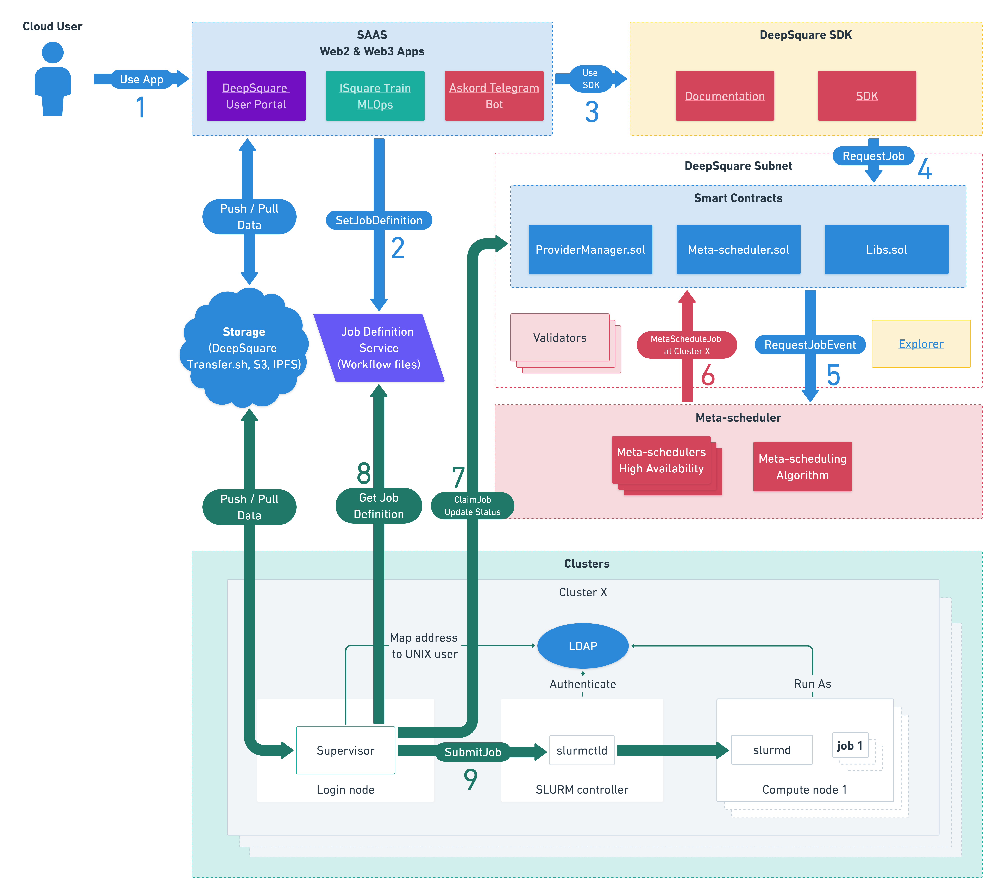

# DeepSquare Overview

DeepSquare is a decentralized high performance computing (HPC) cloud. DeepSquare allows you to run your application on supercomputers around the world without having to worry about the complex underlying infrastructure. With DeepSquare, you can run compute-intensive workloads on the DeepSquare Grid, the interoperability layer made of decentralized heterogeneous supercomputers. By leveraging DeepSquare, you can develop, build, and scale applications with minimal restrictions and permissions due to vendor-locked infrastructure.

## Running on DeepSquare

DeepSquare provides the ability to run a workload on any supercomputer connected to the DeepSquare Grid using a combination of job scheduling, containers and Web3 technologies. Using job scheduling, jobs are intelligently distributed across infrastructure providers. Containers solve compatibility issues with the heterogeneity of different clusters. And Web3 provides true transparency, availability and scale for a global job scheduler.

## What can I use DeepSquare for?

### Fast and easy deployment of HPC workloads

DeepSquare accelerates the deployment lifecycle by always providing a cluster HPC-ready.

### Scaling and clever scheduling

DeepSquare's job scheduler uses several criteria to meet the developer's demand. Whether testing on a small server or running a full HPC infrastructure, there is always a choice.

The DeepSquare Grid's nature also facilitates to dynamically manage workloads, scaling up or down applications as business needs dictate, in near real time.

### Intelligent and transparent billing

**Credit Allocation**
Credit allocation allows users to assign a specific number of credit tokens to a job before running it. When using the SDK, you'll need to specify the amount of credit tokens you want to allocate for your job. It's recommended to allocate more tokens rather than less to prevent job failures due to insufficient credits. The tokens allocated for a job are locked during the entire job process, and any leftover tokens will be returned to your account once the job is complete.

**Allowance System**
Crypto allowance is the maximum amount of cryptocurrency you authorize the platform to spend on your behalf for services provided. By setting a predefined allowance, you can streamline the payment process and prevent your wallet from prompting you to confirm an "increase-allowance" transaction every time you use the platform's services. To set a crypto allowance using the SDK, follow the relevant documentation and API calls provided in the npm package.

**Top-Up Running Job**
If you didn't allocate enough credits initially, the SDK allows you to add more tokens to a running job by calling the TopUpJob method. This top-up functionality ensures that your job continues running without disruptions due to insufficient credits.

**Auto Top-Up Mode**
By enabling Auto Top-Up mode, you allow the platform to automatically add credits to your job and keep it running until the allowance amount is reached. Make sure to set an allowance that corresponds to the amount you agree the platform can take from your wallet, or your job may fail due to insufficient credits despite having available funds in your wallet.

## The Job Scheduling Architecture

DeepSquare uses something similar to a Web-Queue-Worker style of architecture.

Using Web3, DeepSquare's smart contracts combine the "Web-Queue" by providing:

- An identity provider (the user's wallet)
- A persistent database
- A job queue
- A consistent billing system
- A common API

The infrastructure provider uses a worker, which we call the **Supervisor** of jobs that listen to the smart contract queue. The infrastructure provider itself uses another job scheduler called **Slurm** to manage multi-node workloads.

To avoid storing private data on the blockchain, the sbatch API is the intermediary between the Supervisor and the Client. The sbatch API converts a workflow defined by strict specifications into a slurm batch (SBatch) script and stores it temporarily, waiting for the supervisor to claim a job and pull the sbatch script.

If you want to try an already existing client, there is the [DeepSquare Grid Portal](https://app.deepsquare.run). You can also develop your own client using the [DeepSquare SDK](https://www.npmjs.com/package/@deepsquare/deepsquare-client).

## The underlying technology

DeepSquare is composed of a large number of technologies to achieve such a solution:

- The [Solidity programming language](https://docs.soliditylang.org/en/latest/) to write the smart-contracts.
- The [Go](https://go.dev) and [Python](https://www.python.org) programming languages for developing the running services.
- The [Apptainer](https://apptainer.org), and [Enroot](https://github.com/NVIDIA/enroot) container runtime and several Linux kernel features.
- The [Slurm job scheduler](https://slurm.schedmd.com/documentation.html) for resource allocation and isolation.
- And much more!

Each workload is allocated resources by Slurm using [`cgroups`](https://docs.kernel.org/admin-guide/cgroup-v2.html) and is executed in containers using Apptainer or Enroot. Apptainer and Enroot acts as the software compatibility layer.
