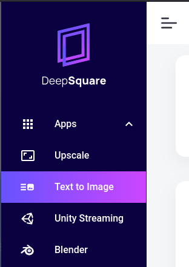

# Quick Start

## Introduction

To explore the features of DeepSquare, all you need is a Google account. This guide will walk you through the process of creating and deploying a workflow on the DeepSquare Grid using the Web2 version of the DeepSquare Portal.

The example provided will illustrate how credits gets allocated, how jobs are submitted and running, and how to watch their status and logs.

## Writing and submitting your first workflow

1. [Log in to the DeepSquare Portal](https://app.deepsquare.run).

   <center>

   

   </center>

2. From the sidebar, open the [**Dev** page](https://app.deepsquare.run/sandbox):

   <center>

   

   </center>

3. Let's run a Stable Diffusion inference, i.e., a text to image. Copy the follwing YAML content into the editor:

   ```yaml title="stable-diffusion.yaml"
   resources:
     tasks: 1
     gpus: 1
     cpusPerTask: 1
     memPerCpu: 32000

   enableLogging: true

   steps:
     - name: stable-diffusion
       use:
         source: github.com/deepsquare-io/workflow-modules/stable-diffusion@v1
         args:
           - key: PROMPT
             value: spatioport scifi deep_space
   ```

   You can replace the `value` of the `PROMPT`, if you want.

4. Submit the job to the DeepSquare Grid by clicking on the **SUBMIT** button:

   <center>

   

   </center>

   After submitting the jobs, credits are allocated for the job. Since we are using Web2, credits are hidden from the user.

5. Go the the [**Job Status** page](https://app.deepsquare.run/status). You should see your job running, or finished.

   <center>

   

   </center>

   You can check the logs and outputs by clicking on the  button.

   <center>

   

   </center>

## Explore more workflows

Deepsquare provides multiple workflows that you can edit to create you own job. You can explore the workflows in the [deepsquare-io/workflow-catalog](https://github.com/deepsquare-io/workflow-catalog) repository.

You can also use fully fledge applications that uses DeepSquare in the **Apps** sidebar.

<center>



</center>

## Next steps

Are you ready to get started? Here are some helpful resources for taking your next steps with DeepSquare:

- For understanding DeepSquare and its internals, follow up on the next part ["Learn - Introduction"](/workflow/learn/introduction).
- For developing complete workflow with DeepSquare, see the ["Getting Started"](/workflow/getting-started/introduction).
- For examples that demonstrate more complex features of Deepsquare, see the ["Guides"](/workflow/guides/overview).
