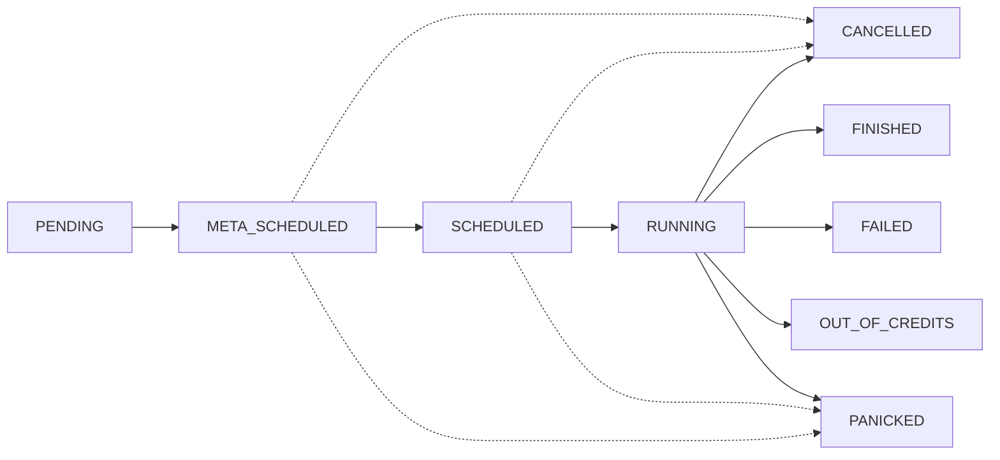

# Running jobs on DeepSquare

DeepSquare allows you to run your computational tasks on any compute provider within the DeepSquare Grid through job scheduling, container technologies, and Web3. Container technologies ensure compatibility across different clusters, while web3 provides transparency, availability, and scalability as the backbone of a global job scheduler.

## Workflow Files: Your Starting Point

A workflow file is a YAML file describing the flow of your application. It outlines resource allocation and the sequence of instructions for your application. Here's an example:

```yaml title="workflow.yaml"
## Allow DeepSquare logging
enableLogging: true

## Allocate resources
resources:
  ## A task is one process. Multiple task will allocate multiple processes.
  tasks: 1
  ## Number of cpu physical thread per process.
  cpusPerTask: 1
  ## Memory (MB) per cpu physical thread.
  memPerCpu: 1024
  ## GPU (graphical process unit) for the whole job.
  gpus: 0

## The job content
steps:
  ## The steps of the jobs which are run sequentially.
  - name: 'hello-world'
    run:
      container:
        image: ubuntu:latest
      command: echo "hello world"
```

Steps are run sequentially, on single or multiple nodes depending on the resource allocation.

## Executing a workflow

To launch a workflow file, you have a couple of choices:

- Use the [DeepSquare CLI](/workflow/cli/getting-started) which a TUI or CLI or Go library, that can be used to interact with the DeepSquare Grid.
- Visit [DeepSquare Dev App](https://app.deepsquare.run/sandbox), paste the workflow, and run it.
- Use the [DeepSquare SDK](https://www.npmjs.com/package/@deepsquare/deepsquare-client) which provides a simple and abstracted interface from web3 to the DeepSquare Grid.

## Job life cycle

After the job is submitted, the job will have an assigned state, and will be treated with a finite state machine.



- `PENDING`: A job has been submitted by a user and is awaiting meta-scheduling.
- `META_SCHEDULED`: The job is assigned to a cluster.
- `SCHEDULED`: The job has been queued internally by the cluster.
- `RUNNING`: The job is being executed.
- `FINISHED`: The job has ended successfully.
- `FAILED`: The job has ended with a non-zero error code.
- `OUT_OF_CREDITS`: The job has ended due to the time limit/credit allocation.
- `CANCELLED`: The job has been cancelled by the user.
- `PANICKED`: The job is in an undefined behavior and has been killed.

## Next steps

Now that you know how a job is structured, you should learn about where does it goes and where does it ends.

See the [Scheduling Architecture](/workflow/learn/architecture) to learn about that.
