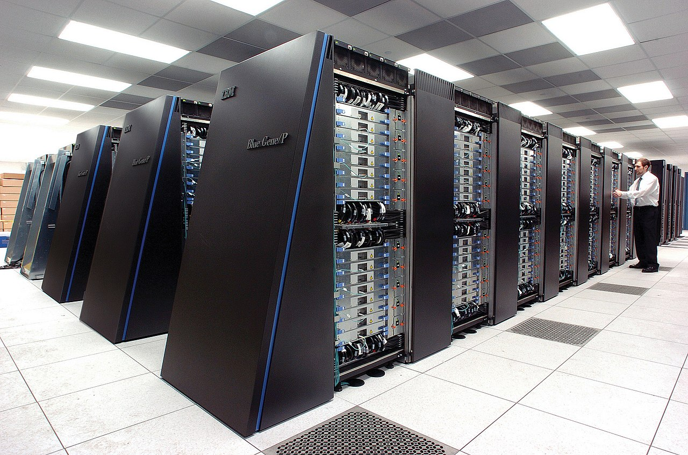
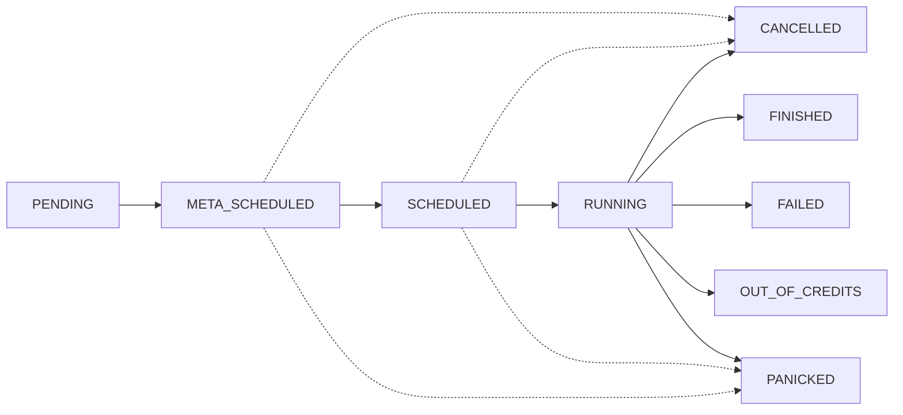

# Understanding DeepSquare and HPC

As you step into the world of DeepSquare and distributed high performance computing (HPC), there are a few fundamental concepts that will help you grasp our operations more effectively. Here, we present you an overview of these concepts.

## Supercomputing and HPC

**Supercomputers** represent the pinnacle of computational capability, utilizing parallel processors to excel in tasks such as intricate simulations, extensive data analysis, and complex problem-solving at exceptionally high speeds. Used in high-stakes computations like weather forecasting, climate research, quantum mechanics, and cryptography, their utilization has traditionally been restricted to certain scientific and governmental entities due to costs and complexity.

_The [IBM](https://en.wikipedia.org/wiki/IBM) [Blue Gene/P](https://en.wikipedia.org/wiki/Blue_Gene) supercomputer "Intrepid" at [Argonne National Laboratory](https://en.wikipedia.org/wiki/Argonne_National_Laboratory)._

**High Performance Computing (HPC)** extends the capabilities of supercomputing by leveraging advanced technologies, including supercomputers, for handling complex and computationally intensive tasks. Unlike supercomputing, which emphasizes the most powerful machines, HPC strives to optimize performance across a range of systems, from server clusters to extensive interconnected supercomputer grids.

HPC plays a crucial role in sectors demanding swift and accurate processing of large datasets. The advent of cloud-based HPC has democratized access to high-performance computing resources, offering on-demand availability and reducing the necessity for significant hardware investments and data center management.

To summarize, while all supercomputers are part of HPC, **HPC goes beyond supercomputers, incorporating various technologies and strategies to achieve the highest level of computational performance.**

## Democratizing HPC with the DeepSquare Grid

### Motivation

As supercomputing is only accessible to a handful of people, DeepSquare aims to make supercomputing accessible to everyone, thanks to the DeepSquare Grid.

The DeepSquare Grid is a global network of computational resources. This network represents a signifies a substantial advancement in distributed computing, providing users with access to a diverse range of supercomputers and HPC resources worldwide. Utilizing a decentralized architecture and meta-scheduling techniques, the DeepSquare Grid facilitates the efficient distribution and execution of computational tasks, fostering a new age of collaborative computing.

### Optimizing job distribution with meta-scheduling

Meta-scheduling is a strategic technique designed to optimize the scheduling of tasks across multiple distributed computing resources. It operates by employing a higher-level scheduler to oversee lower-level schedulers, which handle the allocation of resources and scheduling of jobs on individual machines or clusters. This approach enhances the efficiency of job distribution and resource utilization in complex computing environments.

Meta-scheduling brings about significant advantages in optimizing distributed computing environments. By coordinating task allocation across multiple machines or clusters, it improves **resource utilization**, **minimizing idle time** and e**nhancing overall system efficiency**. The higher-level oversight provided by the meta-scheduler enables **dynamic adaptation to varying workloads,** ensuring **effective load balancing** and **responsiveness** to changing computational demands. Lastly, the technique **enhances fault tolerance** by intelligently redistributing tasks in the event of node failures, contributing to increased system reliability in complex computing environments.

### Predictive job life cycle

In the DeepSquare ecosystem, each job is assigned a status that represents its current state. A job is treated with a Finite State Machine, which allows a predictive behavior in the whole system.

The following are the different types of job statuses:

- `PENDING`: A job has been submitted by a user and is awaiting meta-scheduling.
- `META_SCHEDULED`: The job is assigned to a cluster.
- `SCHEDULED`: The job has been queued internally by the cluster.
- `RUNNING`: The job is being executed.
- `FINISHED`: The job has ended successfully.
- `FAILED`: The job has ended with a non-zero error code.
- `OUT_OF_CREDITS`: The job has ended due to the time limit/credit allocation.
- `CANCELLED`: The job has been cancelled by the user.
- `PANICKED`: The job is in an undefined behavior and has been killed.

## The Main Actors

### Infrastructure Providers

Infrastructure providers are the pillars of the DeepSquare Grid. They are entities that provide computing resources to the users on the network. To maintain the reliability and efficiency of the network, these providers must fulfill certain prerequisites such as maintaining specific hardware or software configurations, regularly updating their systems, and enforcing strong security measures.

Participation as infrastructure providers offers visibility to potential customers, revenue opportunities, and access to a vast network of computing resources and expertise.

### Economy of Compute

The "Economy of Compute" concept focuses on optimizing the use of computing resources to achieve maximum computational output per unit of energy, time, or cost. Key strategies to enhance the economy of compute include parallelization, optimization, efficient resource allocation, and cloud computing. By concentrating on the economy of compute, organizations can not only reduce their operational costs but also boost workload efficiency and reduce environmental impact.

To summarize, by quantifying the computation with a value, we are able to exchange computation and value between cloud providers and the users.

### And, you.

Without you, we couldn't make DeepSquare run. If you are ready to accelerate your software development experience with DeepSquare, you can read the next part about the [storage layout](/workflow/learn/storage-layout).
