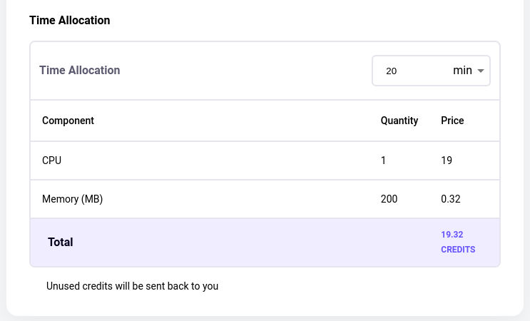
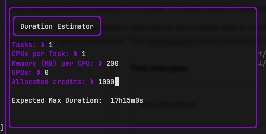
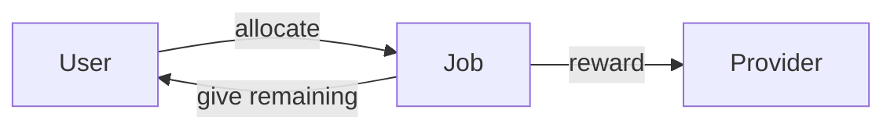
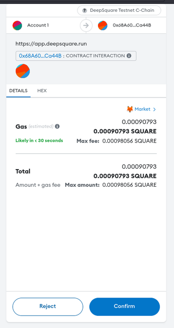

# Credits and SQUARE Tokens

Regardless of how you choose to run the job, whether through the portal or SDK, you need to have credits to pay for the jobs and SQUARE tokens to pay for gas fees. SQUARE tokens function similarly to ether in the Ethereum network, while credits are akin to USDC on the Ethereum blockchain.

You can request free credits [here](https://share-eu1.hsforms.com/18lhtQBNNTVWVRXCm7t-83Aev6gi).

## Inner Workings of Credits

### Credit Allocation

The time limit of a job is directly linked to the number of credits allocated multiplied by the infrastructure provider's pricing.

You'll be prompted to specify the number of credit tokens to allocate when initiating a job via the SDK.

Allocate extra tokens to prevent premature termination due to insufficient credits. Tokens are locked during the job, with remaining tokens returned to your account upon completion. The [DeepSquare portal](https://app.deepsquare.run) disposes of a preview:

But you can also use the [TUI](/workflow/cli/overview):

### Pricing and rewards

Infrastructure providers set prices on the resources:

- GPU cost = provider GPU factor × GPU × minutes
- CPU cost = provider CPU factor × CPU × minutes
- Memory cost = provider Memory factor × Memory (MB) × minutes
- Total cost = GPU cost + CPU cost + Memory cost

In your jobs, you allocates these resources. When the job ends, because the time limit or an early exit, the price is computed and will consume the allocated credits, either partially or completely based on the duration of the job. The infrastructure provider is rewarded at the end of the job.

### Failure management

In rare cases, if a job fails critically or the provider fails to track the life cycle of a job, the cost of the job is zero.

## The SQUARE cryptocurrency

To simply put, this is a temporary cryptocurrency with no value. Right now, DeepSquare is running on a test net:

- Network Name: DeepSquare Testnet
- RPC URL: https://testnet.deepsquare.run/rpc
- Chain ID: 179188

The main cryptocurrency available on that test net are SQUARE tokens. Similar to Ethereum, the SQUARE token are used to rewards validators when sending a transactions. As this is a test network, these validators come mainly from DeepSquare and community contributors.

When interacting with DeepSquare, you will interact with the meta-scheduler smart-contract. Any smart-contract interaction will ask you to pay the gas price (transaction price):

MetaMask will suggest the optimal Gas price, but if you need to accelerate the transaction, you can increase the price.

Note that, sometime, DeepSquare will ask MetaMask to [sign](https://en.wikipedia.org/wiki/Digital_signature) messages. Signing messages doesn't need any cryptocurrency, since this is not a transaction and, therefore, there are no validators to reward.

## Next steps

To gain a practical understanding of executing workloads on our platform, we recommend following our [Getting Started](/workflow/getting-started/introduction) guide. This guide provides a step-by-step tutorial on submitting your first job on the DeepSquare Grid, thereby familiarizing you with our tools and processes.

If you have further inquiries or require assistance, our team is readily available on our [Discord server](https://discord.gg/KYWh28BkUE) to provide support. As you delve deeper into the platform, don't hesitate to reach out to our community and experts who can help you navigate any complexities.

We look forward to supporting your computational work on the DeepSquare platform.
