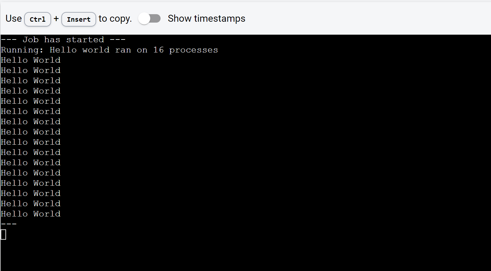

DeepSquare offers a High-Performance Computing (HPC) service platform. To fully leverage its capabilities, understanding the Message Passing Interface (MPI) specifically, [OpenMPI](https://www.open-mpi.org/) is essential. OpenMPI is a standard facilitating parallel computing across diverse processors or machines.

In this section, we'll introduce OpenMPI and its application within the DeepSquare environment. OpenMPI is designed for high performance, wide portability, scalability, and ease of use on systems ranging from small clusters to large supercomputers.

We'll guide you through the process of adapting an existing application to use OpenMPI. Remember, we're here to assist. For any questions or support, please reach out to us on our [Discord server](https://discord.com/invite/zvFnqVHmJh).

## Adapting our "hello world" app to use OpenMPI

Our previous "hello world" workflow was:

```json
{
  "resources": {
    "tasks": 1,
    "gpusPerTask": 0,
    "cpusPerTask": 1,
    "memPerCpu": 1024
  },
  "enableLogging": true,
  "steps": [
    {
      "name": "hello world",
      "run": {
        "command": "echo \"Hello World\""
      }
    }
  ]
}
```

In that example, we only utilized a single task with one CPU and 1024 MB of memory.

Now, we'll scale up and run parallelize the "hello world" command on **16 CPUs** with the same amount of RAM per CPU as before.

Instead of echoing "Hello World" directly from the command entry, we're going to use MPI and run this command:

```
mpirun -np 16 echo 'Hello World'
```

`mpirun` is a command used to run MPI programs. This command is part of the OpenMPI suite of tools that facilitate parallel computing.

- `-np 16`: The `-np` option specifies the number of processes that the `mpirun` command should start. In this case, it's set to 16 because we want to start 16 instances of the program.

- `echo 'Hello World'`: This is the command that is being parallized.

Here is the updated workflow:

```json title="Workflow (don't run it)"
{
  "resources": {
    "tasks": 1,
    "gpusPerTask": 0,
    "cpusPerTask": 16,
    "memPerCpu": 1024
  },
  "enableLogging": true,
  "steps": [
    {
      "name": "Hello world ran on 16 processes",
      "run": {
        "command": "mpirun -np 16 echo 'Hello World'"
      }
    }
  ]
}
```

However, this won't run because our infrastructure already integrates OpenMPI in the workflow API using [PMIx](https://pmix.github.io/standard):

- there is no need to use `mpirun` command.
- the number of tasks **can replace the number of processes defined in `mpirun`!**

So instead, the workflow becomes:

```json title="Workflow"
{
  "resources": {
    "tasks": 16,
    "gpusPerTask": 0,
    "cpusPerTask": 1,
    "memPerCpu": 1024
  },
  "enableLogging": true,
  "steps": [
    {
      "name": "Hello world ran on 16 processes",
      "run": {
        "command": "echo \"Hello World\""
        "resources": {
          "tasks": 16
        },
      }
    }
  ]
}

```

Notice the `resources` block **within the steps block**. That one is different from the `resources allocation` block at the start of the workflow.

Hereafter are the default behavior of the `resources` block in the `steps` block:

- gpusPerTask, cpusPerTask, memPerCpu are inherited from the `resources allocation` block.
- `tasks`, if not specified, set to 1 by default.

If we don't set `tasks` within the `steps` block to 16, then we would allocate 16 tasks but only use one!

More infos about default values are specified in the [API references](/workflow/workflow-api-reference/job#stepsrunresources-steprunresources).

In our case, the execution of the step **implicitly uses** 1 CPU per task, 1024 MB of memory per CPU, and no GPUs per task and **explicitly uses** 16 tasks.

You can launch it on [DeepSquare Dev app](https://app.deepsquare.run/sandbox) to see the results!

<div style={{textAlign: 'center'}}>



</div>

Following our previous 'Hello World' example, where we operated 16 separate processes, we're now going to explore **inter-process communication** with **OpenMPI**. This feature is crucial for high-performance computing as it enables **coordinated tasks and data sharing between multiple processors**.

In our next example, the application, written in C and utilizing OpenMPI, conducts a simple ring test within a distributed computing environment. The main points are as follows:

<details>
<summary>Application code</summary>

```c title="main.c"
/*
 * Copyright (c) 2004-2006 The Trustees of Indiana University and Indiana
 *                         University Research and Technology
 *                         Corporation.  All rights reserved.
 * Copyright (c) 2006      Cisco Systems, Inc.  All rights reserved.
 * Copyright (c) 2023      DeepSquare Association.  All rights reserved.
 *
 * Simple ring test program in C.
 */

#include "mpi.h"
#include <stdio.h>

int main(int argc, char \*argv[]) {
int rank, size, next, prev, message, tag = 201;

/_ Start up MPI _/

MPI_Init(&argc, &argv);
MPI_Comm_rank(MPI_COMM_WORLD, &rank);
MPI_Comm_size(MPI_COMM_WORLD, &size);

/_ Calculate the rank of the next process in the ring. Use the
modulus operator so that the last process "wraps around" to
rank zero. _/

next = (rank + 1) % size;
prev = (rank + size - 1) % size;

/_ If we are the "master" process (i.e., MPI_COMM_WORLD rank 0),
put the number of times to go around the ring in the
message. _/

if (0 == rank) {
message = 10;

    printf("rank 0 sending %d to %d, tag %d (%d processes in ring)\n", message,
           next, tag, size);
    MPI_Send(&message, 1, MPI_INT, next, tag, MPI_COMM_WORLD);
    printf("rank 0 sent to %d\n", next);

}

/_ Pass the message around the ring. The exit mechanism works as
follows: the message (a positive integer) is passed around the
ring. Each time it passes rank 0, it is decremented. When
each processes receives a message containing a 0 value, it
passes the message on to the next process and then quits. By
passing the 0 message first, every process gets the 0 message
and can quit normally. _/

while (1) {
MPI_Recv(&message, 1, MPI_INT, prev, tag, MPI_COMM_WORLD,
MPI_STATUS_IGNORE);
printf("rank %d: received the message %d and is passing to the next: %d\n",
rank, message, next);

    if (0 == rank) {
      --message;
      printf("rank 0 decremented value: %d\n", message);
    }

    MPI_Send(&message, 1, MPI_INT, next, tag, MPI_COMM_WORLD);
    if (0 == message) {
      printf("rank %d exiting\n", rank);
      break;
    }

}

/_ The last process does one extra send to process 0, which needs
to be received before the program can exit _/

if (0 == rank) {
MPI_Recv(&message, 1, MPI_INT, prev, tag, MPI_COMM_WORLD,
MPI_STATUS_IGNORE);
}

/_ All done _/

MPI_Finalize();
return 0;
}

```

</details>

1.  Every process, upon starting, identifies its unique ID (rank) and the total number of processes involved.
2.  Each process recognizes the processes directly before and after it in a looped structure.
3.  The master process (ID 0) starts a message with the value 10 and forwards it to the next process.
4.  The message cycles through the loop of processes, and each time it returns to the master, its value is reduced by 1.
5.  This cycle continues until the message's value reaches 0. When a process receives the 0 message, it passes it on and then stops.
6.  An additional receive operation is included for the master process to ensure it gets the termination message before the application ends.

The application is containerized and publicly accessible by pulling the image at `ghcr.io/eepsquare-io/mpi-example:latest`.

The associated workflow is:

```json title="Workflow"
{
  "resources": {
    "tasks": 16,
    "gpusPerTask": 0,
    "cpusPerTask": 1,
    "memPerCpu": 1024
  },
  "enableLogging": true,
  "steps": [
    {
      "name": "run the circle program",
      "run": {
        "command": "./main",
        "workDir": "/app",
        "resources": {
          "tasks": 16
        },
        "container": {
          "image": "deepsquare-io/mpi-example:latest",
          "registry": "ghcr.io"
        }
      }
    }
  ]
}
```

In the above workflow, you'll notice that we've added a few elements:

- `container`: This keyword initiates a container code block.
- `image`: This is the name of the container image used for the workflow, specified within the `container` block.
- `registry`: This specifies where the image is stored.
- `workDir`: This defines the working directory. When a container image is provided, the path is a directory within the container, relative to the root of the image file system. You can find more info about workDir [here](https://docs.deepsquare.run/workflow/workflow-api-reference/job).

You can launch it on [DeepSquare Dev app](https://app.deepsquare.run/sandbox) to see the results:

<div style={{textAlign: 'center'}}>


</div>

:::note

You may see errors like :

```shell
--------------------------------------------------------------------------
WARNING: There was an error initializing an OpenFabrics device.

  Local host:   cn2
  Local device: mlx5_2
--------------------------------------------------------------------------
```

This is because we did not optimize the OpenMPI parameters. The `mlx*` devices are [Mellanox devices](https://www.nvidia.com/en-us/networking/) and prefer the [Unified Communication X (UCX)](https://openucx.org) point-to-point messaging layer (pml). We recommend this [tech talk](https://www.youtube.com/watch?v=C4XfxUoSYQs) for a better understanding. To tune OpenMPI, you can use environment variables like this:

```json title="Workflow"
{
  "resources": {
    "tasks": 16,
    "gpusPerTask": 0,
    "cpusPerTask": 1,
    "memPerCpu": 1024
  },
  "enableLogging": true,
  "env": [
    {
      "key": "OMPI_MCA_pml",
      "value": "ucx"
    },
    {
      "key": "OMPI_MCA_btl",
      "value": "^vader,tcp,openib,uct"
    }
  ],
  "steps": [
    {
      "name": "run the circle program",
      "run": {
        "command": "./main",
        "workDir": "/app",
        "resources": {
          "tasks": 16
        },
        "container": {
          "image": "deepsquare-io/mpi-example:latest",
          "registry": "ghcr.io"
        }
      }
    }
  ]
}
```

:::

Great job on completing the inter-process communication task using OpenMPI on DeepSquare! You've effectively used multiple processors for synchronized communication - a significant milestone in high-performance computing.

Next, we venture into storage management. Data science projects on HPC often involve large-scale data processing. So, you'll learn how to manage datasets as inputs and outputs, a critical skill to leverage the full potential of the DeepSquare platform. Stay tuned for more!
