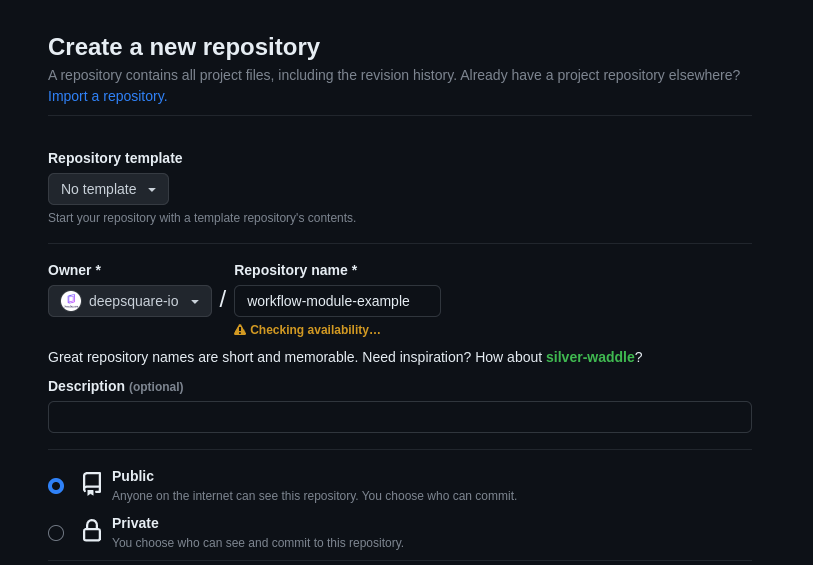

# Creating and publishing a module

Creating a module is quite easy:

1. Create a git repository on a public git hosting service. For this guide, let's create it on github:

   

2. Clone that repository.

   ```shell "user@~/"
   git clone git@github.com:deepsquare-io/workflow-module-example.git
   ```

3. At the root of the repository, create a `module.yaml` and fill it with your group of steps.

   ```yaml "module.yaml"
   name: 'Hello World'
   description: 'An example of module'
   inputs:
     - key: WHO
       description: 'Who to greet'
       default: 'World'
   outputs:
     - key: RESULT
       despcription: 'Resulting string'
   minimumResources:
     tasks: 1
     cpusPerTask: 1
     memPerCpu: 100
     gpusPerTask: 0
   steps:
     - name: 'Say hello World'
       run:
         container:
           registry: registry-1.docker.io
           image: library/busybox:latest
         command: |
           echo "Running with {{ .Job.Resources.MemPerCPU }}M of memory"
           echo "Hello ${WHO}"
           echo "RESULT=Hello ${WHO}" >> ${DEEPSQUARE_ENV}
   ```

   You must describe:

   - The `name` of the module.
   - A module `description`.
   - The `minimumResources` which are the minimum requirements for your module to work as expected.
   - The `steps` which is the main body of the module.

   Optionally, you can describe:

   - expected `inputs` which the user of the module can use by adding a value to the `args` field of the [_StepUse_](/workflow/workflow-api-reference/job#steprsuse-stepuse).
   - expected `outputs`, which can be exported if the user of the module specify the `exportEnvAs` field of the [_StepUse_](/workflow/workflow-api-reference/job#steprsuse-stepuse).

   Notice that the `module.yaml` goes through a Go template engine before being used. This means you can access to context variables like [`Job`](/workflow/workflow-api-reference/job) or [`Step`](/workflow/workflow-api-reference/job#steps-step). This can help you design your module according based on the job or step specifications.

4. Commit and push.

   ```shell title="user@~/workflow-module-example"
   git add module.yaml
   git commit -m "added module.yaml"
   git push -u origin main

   ```

5. Add tags to your module.

   ```shell title="user@~/workflow-module-example"
   git tag -m "v1" v1
   git push origin v1
   git tag -m "v1.0.0" v1.0.0
   git push origin v1.0.0
   ```

That's it! Now users can use your module by either specifying:

- `github.com/deepsquare-io/workflow-module-example@v1`
- `github.com/deepsquare-io/workflow-module-example@v1.0.0`
- `github.com/deepsquare-io/workflow-module-example@<commit-sha>`, the commit SHA can be shorten to 7 characters.
