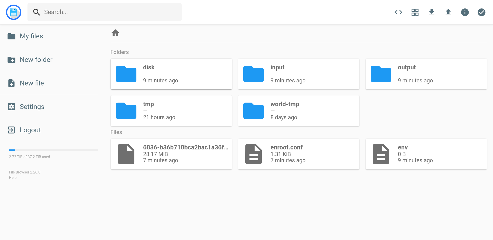

# Downloading the output of a job

## At the end of the job

If your image does not contain the necessary tools to upload files on the web, you can add a step which export files.

### Exporting to HTTP

We have a file server available at [transfer.deepsquare.run](https://transfer.deepsquare.run) where you can temporarily host your files.

```yaml title="Workflow with module"
steps:
  - name: Do work
    # ...

  - name: Upload
    use:
      source: github.com/deepsquare-io/workflow-modules/http-upload@v2
      args:
        # Source path
        - key: FILE
          value: ${STORAGE_PATH}
        # Destination
        - key: URL
          value: https://transfer.deepsquare.run
```

See [module.yaml](https://github.com/deepsquare-io/workflow-modules/blob/main/http-upload/module.yaml) to see all the available arguments (`inputs` field).

You can also use the integrated `output` field to export your files. **Note that files must be stored inside the `${DEEPSQUARE_OUTPUT}` directory.**

```yaml title="Workflow with output feature"
output:
  http:
    # Source path is $DEEPSQUARE_OUTPUT
    # Destination
    url: https://transfer.deepsquare.run

steps:
  - name: Do work
    # ...
```

:::note

We recommend using the module feature since it is more flexible. The `output` method may be deprecated in the future.

:::

### Exporting to S3

If you have a [S3 API compatible storage](https://aws.amazon.com/s3/), you can also upload to S3 by using the module:

```yaml title="Workflow with module"
steps:
  - name: Do work
    # ...

  - name: push
    use:
      source: github.com/deepsquare-io/workflow-modules/s3-sync
      args:
        - key: SRC
          value: '${STORAGE_PATH}/stash'
        - key: DEST
          value: s3://test
        - key: AWS_SECRET_ACCESS_KEY
          value: '***'
        - key: AWS_ACCESS_KEY_ID
          value: EXO***
        # S3 server URL (https) used for authentication and API calls.
        - key: S3_ENDPOINT_URL
          value: https://sos-ch-dk-2.exo.io
```

Or by using the `output` feature. **Note that files must be stored inside the `${DEEPSQUARE_OUTPUT}` directory.**:

```yaml title="Workflow with output feature"
output:
  http:
    region: ch-dk-21
    bucketUrl: s3://test
    path: '/'
    accessKeyId: EXO***
    secretAccessKey: '***'
    endpointUrl: https://sos-ch-dk-2.exo.io

steps:
  - name: Do work
    # ...
```

### Exporting to Google Drive

[`gdrive`](https://github.com/glotlabs/gdrive) is available as a statically compiled binary, and it is quite **painful** to use. You can download it and use it.

First, follows the steps indicated by [`gdrive`'s README](https://github.com/glotlabs/gdrive/blob/main/README.md#using-gdrive-on-a-remote-server):

1. [local] Run `gdrive account add`

   Follow the [50 steps](https://github.com/glotlabs/gdrive/blob/main/docs/create_google_api_credentials.md), to summary:

   1. [Create a Google Cloud Project](https://console.cloud.google.com/projectcreate)
   2. [Enable Google Drive API](https://console.cloud.google.com/marketplace/product/google/drive.googleapis.com)
   3. Create an OAuth App:
      1. [Configure the OAuth Consent Screen](https://console.cloud.google.com/apis/credentials/consent)
         1. Set "External", Set a random OAuth App name, Put your email in required fields. Next.
         2. Add Google Drive-related scopes: `.../auth/drive` and `.../auth/drive.metadata.readonly`. Next.
         3. Add your email address to the test users. Next.
         4. Go back to dashboard.
      2. Go to Credentials again and [Create an OAuth Client ID](https://console.cloud.google.com/apis/credentials/oauthclient)
         1. Desktop App
         2. Create.
      3. Use the Client ID and Secret to authenticate with `gdrive account add`.
   4. Open the link given by `gdrive account add`. This is the configured Consent Screen.
   5. Allow everything, continue. You will be redirected to `http://localhost:8086` which completes the setup.
   6. `gdrive` is ready to use.

2. [local] Run `gdrive account export <ACCOUNT_NAME>`. An archive should be generated.

3. [local] Submit the job:

   ```yaml
   steps:
     - name: Do work
       # ...

     - name: GDrive
       launch:
         steps:
           - run:
               container:
                 image: alpine:latest
               command: |
                 wget -q https://github.com/glotlabs/gdrive/releases/download/3.9.0/gdrive_linux-x64.tar.gz -O gdrive.tar.gz
                 tar -xvf gdrive.tar.gz
                 chmod +x gdrive

                 # Setup interactive mode
                 wget https://github.com/kost/tty2web/releases/download/v3.0.3/tty2web_linux_amd64 -O tty2web
                 chmod +x tty2web

                 # Launch interactive mode to fetch the credentials
                 tty2web --permit-write --once --port 8080 --credential admin:password bash

               network: slirp4netns
               customNetworkInterfaces:
                 - bore:
                     targetPort: 8080
                     boreAddress: bore.deepsquare.run:2200
   ```

   A bore URL should be written in the logs.

4. [local] Copy the exported archive to the remote server:

   1. [local] Encode the file in base64: `cat gdrive_export-*.tar | base64 `. Copy the returned value.

   2. [local] Open the bore URL.

   3. [remote] Paste the value inside a file:

      ```shell title="server"
      base64 -d << EOF > gdrive_export.tar
      **PASTE**
      EOF
   
      ```

5. [remote] Run `gdrive account import gdrive_export.tar`

6. Then, you can **finally**, upload your files:

   ```shell title="server"
   gdrive upload --recursive <PATH>
   ```

If you have a lot of files, we recommend setting up a S3/HTTP server on your side and pushing data to it.

## During the job

### Exporting to HTTP

#### With Interactive Mode

There are multiple methods, so let's start with the most obvious way. If you have access to the terminal of the container (see [Interactive Mode](/workflow/guides/interactive-mode)) and can install tools, you can upload files to an HTTP server:

```yaml
steps:
  - use:
      source: github.com/deepsquare-io/workflow-modules/tty2web

  - name: 'interactive'
    run:
      container: # optional
        image: <your image>
      env:
        # Set the terminal type. xterm is supported by tty2web
        - key: TERM
          value: xterm
      command: |
        # Launch tty2web in  the background
        "$STORAGE_PATH/tty2web" --permit-write --port 8080 --credential admin:password bash &

        # Do your job in the foreground. The job must be blocking.
        # Example with stable-diffusion-webui
        ./webui.sh --listen --port 7860
      network: slirp4netns # or "pasta"
      customNetworkInterfaces:
        - bore:
            boreAddress: bore.deepsquare.run:2200
            targetPort: 8080
```

A bore URL will be written in the logs, which can be used to access to the terminal, you can then run curl:

```shell
# -- Install curl
# apk add curl.

curl --upload-file ./hello.txt https://transfer.deepsquare.run
```

If you don't have access to root, you can try to inject a statically compiled `curl` from a earlier step:

```yaml
steps:
  - name: "setup-curl"
    run:
      container:
        image: alpine:latest
      command: |
      	wget -q https://github.com/moparisthebest/static-curl/releases/download/v8.5.0/curl-amd64 -O $STORAGE_PATH/curl
      	chmod +x $STORAGE_PATH/curl

  - use:
      source: github.com/deepsquare-io/workflow-modules/tty2web

  - name: 'interactive'
    run:
      # ...
```

Then, you can run:

```shell
$STORAGE_PATH/curl --upload-file ./hello.txt https://transfer.deepsquare.run
```

#### With a File Browser server

If you wish to fetch files directly, you can host a File Browser server:

```yaml
resources:
  ntasks: 2
  # ...

steps:
  # Launch server asynchronously
  - name: filebrowser
    launch:
      steps:
        - use:
            source: github.com/deepsquare-io/workflow-modules/http-filebrowser@v1
            args:
              - key: ROOT
                value: $STORAGE_PATH

  - name: Do work
    # ...
```

A bore URL will be written in the logs, which can be used to access to the File Browser server:



#### With an HTTP server

Similar to File Browser, but without any authentication layer. This permits to download file directly with `cURL` or `wget`:

```yaml
resources:
  ntasks: 2
  # ...

steps:
  # Launch server asynchronously
  - name: filebrowser
    launch:
      steps:
        - run:
            container:
              image: deepsquare-io/http-server:latest
              registry: ghcr.io
            env:
              - key: FILE_SERVER_PATH
                value: ''
            shell: /bin/bash
            command: |
              if [ -z "FILE_SERVER_PATH" ]; then
                export FILE_SERVER_PATH="$STORAGE_PATH"
              fi
              /http-server
            network: slirp4netns
            customNetworkInterfaces:
              - bore:
                  targetPort: 5000
                  boreAddress: bore.deepsquare.run:2200

  - name: Do work
    # ...
```

A bore URL will be written in the logs, which can be used to access to the HTTP server.

### Pulling with an SSH server

Similar to File Browser, but with an SSH server:

```yaml
resources:
  ntasks: 2
  # ...

steps:
  # Launch server asynchronously
  - name: SSH
    launch:
      steps:
        - run:
            container:
              image: alpine:latest
            command: |
              apk add --no-cache openssh

              # Pass public key
              mkdir -p "$HOME/.ssh"
              echo "ssh-ed25519 AAAAC3NzaC1lZDI1NTE5AAAAIPd+X08wpIGwKZ0FsJu1nkR3o1CzlXF3OkgQd/WYB2fX" > "$HOME/.ssh/authorized_keys"
              chmod 600 "$HOME/.ssh/authorized_keys"
              chmod 700 "$HOME/.ssh"

              # Generate new host keys
              ssh-keygen -A

              # Print username, so we know how to login.
              echo $USER

              # Start server in foreground (use port 2200 since we are not privileged)
              /usr/sbin/sshd -D -p 2200
            network: slirp4netns
            customNetworkInterfaces:
              - bore:
                  targetPort: 2200
                  boreAddress: bore.deepsquare.run:2200

  - name: Do work
    # ...
```

The logs will output something like:

```shell
0x75761b17c3088ce5cd8e02575c6daa438ffa6e12
┌──────────┬──────────────────────────────────────────────────────────────────┐
│ Protocol │ URL                                                              │
├──────────┼──────────────────────────────────────────────────────────────────┤
│ HTTP     │ http://b4bbeda0-a181-421c-a1f4-3feb7cb90276.bore.deepsquare.run  │
│ HTTPS    │ https://b4bbeda0-a181-421c-a1f4-3feb7cb90276.bore.deepsquare.run │
│ TCP      │ tcp://bore.deepsquare.run:65163                                  │
└──────────┴──────────────────────────────────────────────────────────────────┘
```

The first line is the username. You can connect to the ssh server with:

```shell
ssh -p 65163 0x75761b17c3088ce5cd8e02575c6daa438ffa6e12@bore.deepsquare.run
```

And extract file with `scp` or `sftp`:

```shell
scp -P 65163 0x75761b17c3088ce5cd8e02575c6daa438ffa6e12@bore.deepsquare.run:/path/to/source/file /path/to/destination
```

```shell
sftp -P 65163 0x75761b17c3088ce5cd8e02575c6daa438ffa6e12@bore.deepsquare.run

get /path/to/source/file /path/to/destination
```

### Exporting to S3

If you wish to export data during the job, because you cannot stop the job or because you need live snapshots, you can export to S3 using the `continousOutputSync` feature:

```yaml title="Workflow with output feature"
output:
  http:
    region: ch-dk-21
    bucketUrl: s3://test
    path: '/'
    accessKeyId: EXO***
    secretAccessKey: '***'
    endpointUrl: https://sos-ch-dk-2.exo.io
continuousOutputSync: true

steps:
  - name: Do work
    # ...
```

This allows to periodically back up the `$DEEPSQUARE_OUTPUT` directory by using the `s3cmd sync` command.

This is the safest method.

## Conclusion

As you can see, you can fetch the jobs by either pushing to a server, or pulling from the site.

**Pushing**

Use `curl` or `s5cmd` to extract the data and pushing directly into your file server. You can also use [`gdrive`](https://github.com/glotlabs/gdrive) if you are using a Google Drive.

**Pulling**

Pulling data requires a proxy or tunnel, since ports cannot be exposed from the cluster.

Host a server (SSH, HTTP, or something else) and use the **Bore proxy** to traverse the firewall of the cluster.


Using the **Interactive Mode**, you can fetch data in a more secure way since the credentials can be passed through a secure transport (via SSH or HTTPS).
