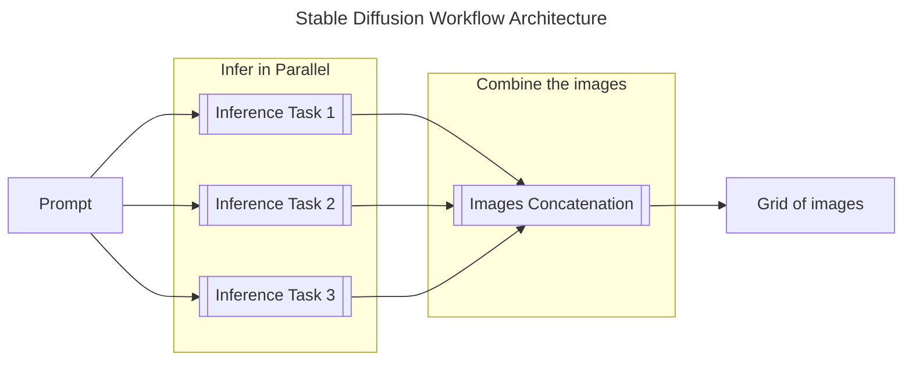

# Stable Diffusion

DeepSquare integrates the neural network text-to-image model [Stable Diffusion](https://github.com/Stability-AI/stablediffusion).

This guide presents how we designed and implmented the workflow to execute Stable Diffusion on the DeepSquare Grid.

## Design

We designed the workflow as follows:

- The prompt is sent over an environment variable.
- Most of the parameters are sent via environment varibles.
- Images are sent to https://transfer.deepsquare.run/

The docker image is already compiled from [github.com/Stability-AI/stablediffusion](https://github.com/Stability-AI/stablediffusion) and is exported as `registry-1.deepsquare.run/library/stable-diffusion:latest`.

The steps are as follows:

1. Generate the images. Rows are distributed into task per GPU.

2. Combine all the images into one grid.



## Implementation

Let's start with the input, output and resources.

### Resource allocation, environment variable and input/output

We will use 4 parallel tasks. Each task has 8 CPUS, 8 GB of RAM, 1 GPU.

```yaml
enableLogging: true
resources:
  tasks: 4
  cpusPerTask: 8
  memPerCpu: 8000
  gpus: 4
output:
  http:
    url: https://transfer.deepsquare.run/
continuousOutputSync: true
env:
  - key: STEPS
    value: '50'
  - key: HEIGHT
    value: '768'
  - key: WIDTH
    value: '768'
  - key: MODEL
    value: 'sd-2-1'
  - key: ITER # Number of rows, we want 1 row per task
    value: '1'
  - key: SAMPLES # Number of columns. Depends on the VRAM
    value: '3'
  - key: PROMPT
    value: 'an astronaut in space'
```

### 1. Inference loop

We just need to execute a `for` directive which executes 4 steps in parallel.

```yaml
steps:
  - name: generation-loop
    for:
      parallel: true
      range:
        begin: 1
        end: 4
      steps:
        - name: generate image
          run:
            resources:
              gpusPerTask: 1
            container:
              deepsquareHosted: true,
              apptainer: true,
              registry: 'registry-1.deepsquare.run',
              image: 'library/stable-diffusion:latest',
              mounts:
                - hostDir: '/data/beegfs/cache/persistent',
                  containerDir: '/cache',
                  options: 'rw',
                - hostDir: '/opt/models/stable-diffusion',
                  containerDir: '/models',
                  options: 'ro',
            env:
              - key: HF_HOME
                value: /cache
            shell: '/bin/bash'
            command: |
              set -e

              mkdir -p "${STORAGE_PATH}/batch-${index}"
              params=(
                "--ckpt" "/models/$MODEL/model.ckpt"
                "--outdir" "${STORAGE_PATH}/batch-${index}"
                "--H" "$HEIGHT"
                "--W" "$WIDTH"
                "--steps" "$STEPS"
                "--n_iter" "$ITER"
                "--device" "cuda"
                "--n_samples" "$SAMPLES"
                "--seed" "$(od -N 4 -t uL -An /dev/urandom | tr -d " ")"
                "--prompt" "$PROMPT"
              )
              if [ -f "/models/$MODEL/config.yaml" ]; then
                params+=("--config" "/models/$MODEL/config.yaml")
              fi

              python /stablediffusion/scripts/txt2img.py "${params[@]}"
              cd "${STORAGE_PATH}/batch-${index}"
              find . -type f -not -name "grid*.png" -exec sh -c 'i="$1"; mv "$i" "$(md5sum "$i" | cut -d " " -f 1 | cut -c -12).png"' shell "{}" \\;
              mv grid*.png "grid_${index}.png"

```

DeepSquare already hosts its own models at `/opt/models`. If you plan to use your own model, you should import the model using the `input` directive.

The last step is to assemble the rows into a grid.

### 2. Combine the rows

Our docker image already includes ImageMagick, meaning we can compose a new image from the generated images.

```yaml
steps:
  # ...
  - name: combine-images
    run:
      container:
        deepsquareHosted: true,
        apptainer: true,
        registry: 'registry-1.deepsquare.run',
        image: 'library/stable-diffusion:latest',
      shell: '/bin/bash'
      command: |
        set -e

        cd "${STORAGE_PATH}"
        mv $(find . -maxdepth 2 -type f | grep ".png") "$DEEPSQUARE_OUTPUT"
        cd "$DEEPSQUARE_OUTPUT"
        convert -append grid*.png ./results_grid.png
        rm grid*.png
        echo "${PROMPT}" > input.txt
        echo "##############################################################"
        echo
        echo "Input:"
        echo "${PROMPT}"
        echo
        echo "Click on this link to preview your results:"
        curl -sS --upload-file "./results_grid.png" https://transfer.deepsquare.run/
        echo
        echo
        echo "##############################################################"

        chmod -R 777 /cache/* 2>/dev/null || true
```

We send the "grid" image to https://transfer.deepsquare.run/. The output directory contains all the images in their original resolution, which will be sent to https://transfer.deepsquare.run/.

## Conclusion

We have developed an ML inference workflow. Most inference processes with an output will follow the same pattern:

1. Launch the inference in parallel
2. Reassemble the output

<details>

<summary>Complete Workflow</summary>

```yaml
enableLogging: true
resources:
  tasks: 4
  cpusPerTask: 8
  memPerCpu: 8000
  gpus: 1
output:
  http:
    url: https://transfer.deepsquare.run/
continuousOutputSync: true
env:
  - key: STEPS
    value: '50'
  - key: HEIGHT
    value: '768'
  - key: WIDTH
    value: '768'
  - key: MODEL
    value: 'sd-2-1'
  - key: ITER # Number of rows, we want 1 row per task
    value: '1'
  - key: SAMPLES # Number of columns. Depends on the VRAM
    value: '3'
  - key: PROMPT
    value: 'an astronaut in space'
steps:
  - name: generation-loop
    for:
      parallel: true
      range:
        begin: 1
        end: 4
      steps:
        - name: generate image
          run:
            resources:
              gpusPerTask: 1
            container:
              deepsquareHosted: true,
              apptainer: true,
              registry: 'registry-1.deepsquare.run',
              image: 'library/stable-diffusion:latest',
              mounts:
                - hostDir: '/data/beegfs/cache/persistent',
                  containerDir: '/cache',
                  options: 'rw',
                - hostDir: '/opt/models/stable-diffusion',
                  containerDir: '/models',
                  options: 'ro',
            env:
              - key: HF_HOME
                value: /cache
            shell: '/bin/bash'
            command: |
              set -e

              mkdir -p "${STORAGE_PATH}/batch-${index}"
              params=(
                "--ckpt" "/models/$MODEL/model.ckpt"
                "--outdir" "${STORAGE_PATH}/batch-${index}"
                "--H" "$HEIGHT"
                "--W" "$WIDTH"
                "--steps" "$STEPS"
                "--n_iter" "$ITER"
                "--device" "cuda"
                "--n_samples" "$SAMPLES"
                "--seed" "$(od -N 4 -t uL -An /dev/urandom | tr -d " ")"
                "--prompt" "$PROMPT"
              )
              if [ -f "/models/$MODEL/config.yaml" ]; then
                params+=("--config" "/models/$MODEL/config.yaml")
              fi

              python /stablediffusion/scripts/txt2img.py "${params[@]}"
              cd "${STORAGE_PATH}/batch-${index}"
              find . -type f -not -name "grid*.png" -exec sh -c 'i="$1"; mv "$i" "$(md5sum "$i" | cut -d " " -f 1 | cut -c -12).png"' shell "{}" \\;
              mv grid*.png "grid_${index}.png"
  - name: combine-images
    run:
      container:
        deepsquareHosted: true,
        apptainer: true,
        registry: 'registry-1.deepsquare.run',
        image: 'library/stable-diffusion:latest',
      shell: '/bin/bash'
      command: |
        set -e

        cd "${STORAGE_PATH}"
        mv $(find . -maxdepth 2 -type f | grep ".png") "$DEEPSQUARE_OUTPUT"
        cd "$DEEPSQUARE_OUTPUT"
        convert -append grid*.png ./results_grid.png
        rm grid*.png
        echo "${PROMPT}" > input.txt
        echo "##############################################################"
        echo
        echo "Input:"
        echo "${PROMPT}"
        echo
        echo "Click on this link to preview your results:"
        curl -sS --upload-file "./results_grid.png" https://transfer.deepsquare.run/
        echo
        echo
        echo "##############################################################"

        chmod -R 777 /cache/* 2>/dev/null || true
```

</details>
