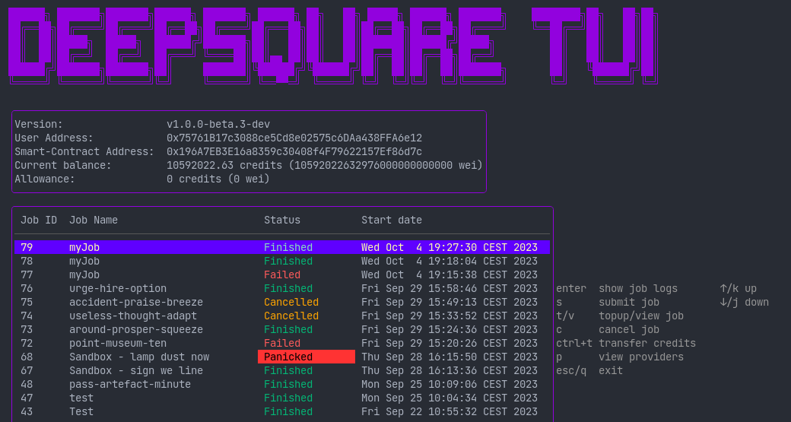

# Overview

## What is the `deepsquaretui`?

The `deepsquaretui` is an essential utility for orchestrating job workflows, managing resource allowances, and optimizing compute resource allocation on the DeepSquare Grid.

The `deepsquaretui` has two modes of interactivity: as a command line interface (CLI) and as a terminal user interface (TUI). The CLI is invoked when the `deepsquaretui` is used with a command, e.g. `deepsquaretui submit job.yaml`. The TUI is called when the `deepsquaretui` is used without any command:

## Key features

- **Job Scheduling:** `deepsquaretui` allows you to create, monitor, and control job workflows seamlessly. It simplifies the process of orchestrating complex tasks across your compute infrastructure.
- **Resource Allocation:** Manage allowances and credits with ease, ensuring that your jobs run efficiently and cost-effectively.
- **Text User Interface (TUI):** The TUI interface provides an intuitive and interactive way to navigate and interact with the tool, enhancing the user experience.
- **Zero-dependency, One Binary, Multi-platform, Blazingly Fast:** Programmed in Go, it can interact with EVM-compatible APIs on any operating system, without the need to install a runtime or any other dependencies. All it takes is a simple drag-and-drop.
- **Customization:** Configure your tool to match your specific requirements, whether it's adjusting RPC endpoints, setting up smart contracts, or fine-tuning private key options.

In this documentation, you will find comprehensive guidance on using both the CLI and TUI versions of `deepsquaretui`. Whether you're new to the tool or a seasoned user, we've got you covered.

Let's get started with managing job workflows, optimizing compute resources, and unleashing the full potential of the DeepSquare Grid with `deepsquaretui`!
