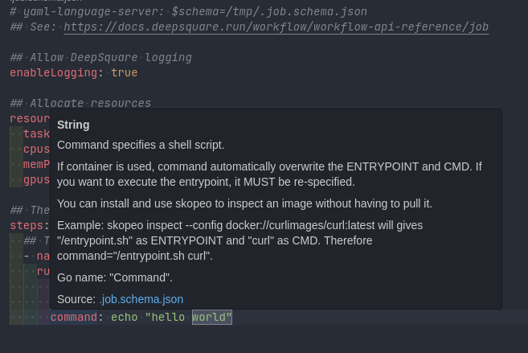
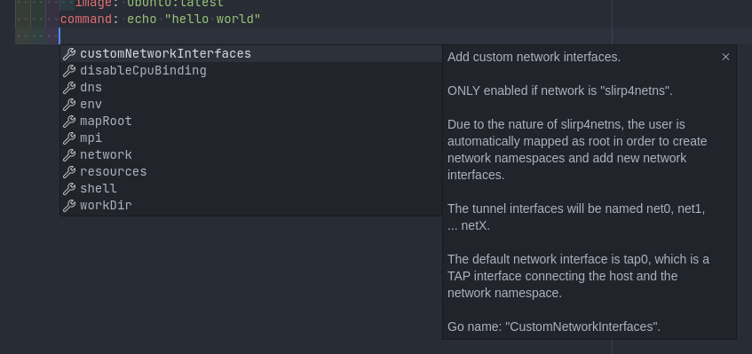
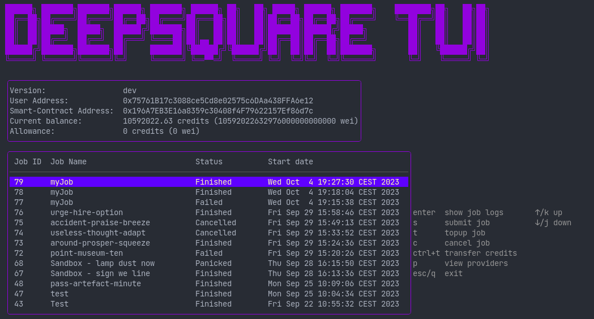
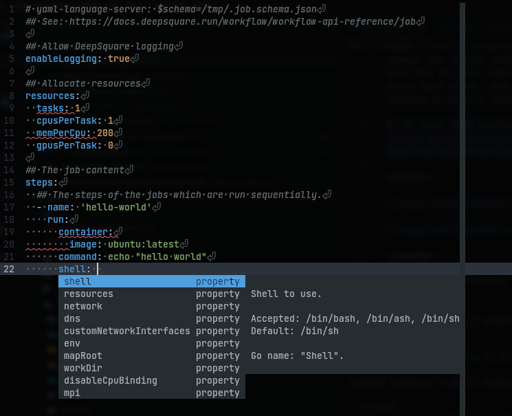

# `init`: Creating and writing a workflow file.

## Using as a CLI

1. You can initialize a basic YAML workflow by running:

   ```shell
   dps init
   ```

   ```yaml title="job.<random>.yaml"
   # yaml-language-server: $schema=/tmp/.job.schema.json
   ## See: https://docs.deepsquare.run/workflow/workflow-api-reference/job

   ## Allow DeepSquare logging
   enableLogging: true

   ## Allocate resources
   resources:
     tasks: 1
     cpusPerTask: 1
     memPerCpu: 200
     gpusPerTask: 0

   ## The job content
   steps:
     ## The steps of the jobs which are run sequentially.
     - name: 'hello-world'
       run:
         container:
           image: ubuntu:latest
         command: echo "hello world"
   ```

2. You can edit it with your favorite YAML IDE that supports the [yaml-language-server by RedHat](https://github.com/redhat-developer/yaml-language-server). Or, you can use the [online editor of the Nexus](https://app.deepsquare.run/sandbox).

3. The YAML language server should detect the JSON schema and show the documentation for each field:

<center>





(Example with [VSCode](https://code.visualstudio.com))

</center>

If you need help in writing a workflow file, you can consult the [Getting Started](/workflow/getting-started/introduction) or consult the [workflow reference API](/workflow/workflow-api-reference/job).

To submit a job, follow the steps indicated in the [next page](submit).

## Using as a TUI

1. Start the TUI by running `dps`:

   

2. Press <kbd>s</kbd> to create a workflow file and open the workflow editor. Based on your environment variables, it will open your default visual text editor. On Linux, it is possible to change the visual text editor by changing the `VISUAL` environment variable. On Windows, the TUI will try to open `nano.exe`, `vim.exe`, `notepad++.exe` or `notepad.exe`. If none of these editors suits your needs, you can quit the editor and open the workflow file that has been created in the working directory with your favorite text editor.

3. If your text editor supports the [yaml-language-server by RedHat](https://github.com/redhat-developer/yaml-language-server), the YAML language server should detect the JSON schema and show the documentation for each field:

<center>



_(Example with [Helix](https://helix-editor.com))_

</center>

If you need help in writing a workflow file, you can consult the [Getting Started](/workflow/getting-started/introduction) or consult the [workflow reference API](/workflow/workflow-api-reference/job).

To submit a job, follow the steps indicated in the [next page](submit).
