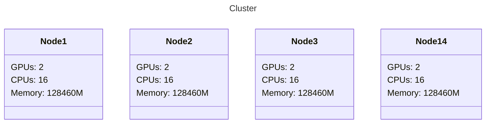
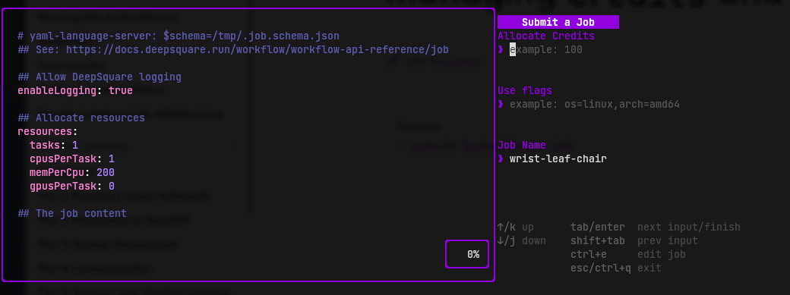
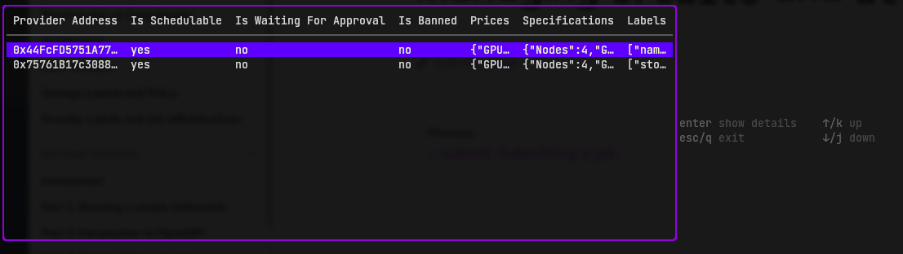
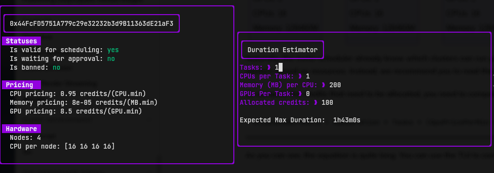
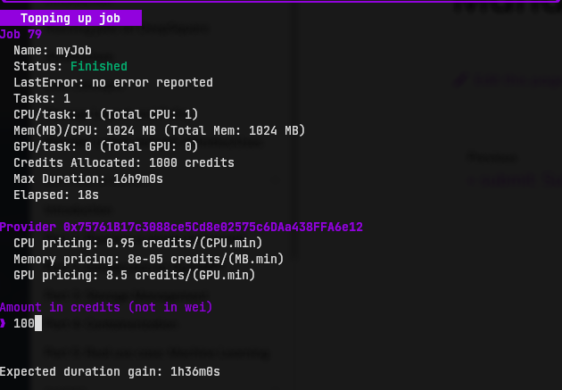
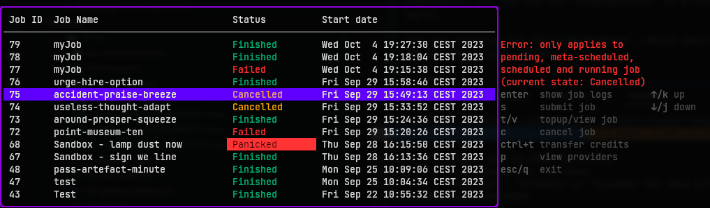

# `submit`: Submitting a job

After you've prepared your workflow, you can submit it to the DeepSquare Grid.

## Using as a CLI

**Submitting a job**

If you have prepared your workflow file, you can submit the job using the `deepsquaretui submit` command, like so:

```shell
deepsquaretui submit -w -e --credits 100 --job-name test job.emotion-echo-climb.yaml
# -w: Watch logs after submitting the job
# -e: Exit the job after the job has finished and throw on error.
# --credits value: Allocated a number of credits.
```

Usage:

```shell
deepsquaretui submit [command options] <job.yaml>

OPTIONS:
   DeepSquare Settings:

   --logger.endpoint value               Grid Logger endpoint. [$LOGGER_ENDPOINT]
   --metascheduler.rpc value             Metascheduler Avalanche C-Chain JSON-RPC endpoint. [$METASCHEDULER_RPC]
   --metascheduler.smart-contract value  Metascheduler smart-contract address. [$METASCHEDULER_SMART_CONTRACT]
   --metascheduler.ws value              Metascheduler Avalanche C-Chain WS endpoint. [$METASCHEDULER_WS]
   --private-key value                   An hexadecimal private key for ethereum transactions. [$ETH_PRIVATE_KEY]
   --sbatch.endpoint value               SBatch Service GraphQL endpoint. [$SBATCH_ENDPOINT]

   Submit Settings:

   --affinities key<value [ --affinities key<value ]  Affinities flag. Used to filter the clusters. Format: key<value, `key<=value`, `key=value`, `key>=value`, `key>value`, `key!=value`
   --credits value                                    Allocated a number of credits. Unit is 1e18. Is a float and is not precise. (default: 0)
   --credits-wei value                                Allocated a number of credits. Unit is wei. Is a big int.
   --exit-on-job-exit, -e                             Exit the job after the job has finished and throw on error. (default: false)
   --job-name value                                   The job name.
   --no-timestamp, --no-ts                            Hide timestamp. (default: false)
   --uses key=value [ --uses key=value ]              Uses flag. Used to filter the clusters. Format: key=value
   --watch, -w                                        Watch logs after submitting the job (default: false)
```

If you have written you workflow file, you should already know that DeepSquare works with resources allocation. The allocatable resources CPUs, GPUs, Memory, Tasks (Processes) and the Max Job Duration. Setting the max job duration isn't quite trivial since all the providers have their own pricing. You also cannot directly allocate a duration, instead, you need to allocate the credits.

**Provider listing and fetching**

To control the duration, we recommend to look for the appropriate infrastructure provider for your job:

```shell
deepsquaretui provider list
```

Which returns a complex JSON object. If you want a better experience, you can use the `deepsquaretui` as a TUI (see next part).

You can retrieve the `ProviderHardware`, which describes the cluster resources. Example:

```json
{
  "Nodes": 4,
  "GpusPerNode": [2, 2, 2, 2],
  "CpusPerNode": [16, 16, 16, 16],
  "MemPerNode": [128460, 128460, 128460, 128460]
}
```

Represents:



Naturally, the meta-scheduler already know which clusters can run your workload, so you may not need to filter the clusters based on resources. Instead, we recommend you to read the labels, and [filters using Use flags or Affinities](/workflow/learn/providers-labels).

Next, retrieve the `ProviderPrices`:

```json
{
  "GpuPricePerMin": 8500000000000000000,
  "CpuPricePerMin": 950000000000000000,
  "MemPricePerMin": 80000000000000
}
```

The prices are in wei, therefore, to convert them in credits, you need to divide by 1e18:

```json
{
  "GpuPricePerMin": 8.5,
  "CpuPricePerMin": 0.95,
  "MemPricePerMin": 0.00008
}
```

To compute the credits to be allocated, you need to compute this equation:

```
AllocatedCredits = MaxDuration * Tasks * (GpuPricePerMin * GpusPerTask + CpuPricePerMin * CpusPerTask + MemPricePerMin * MemPerCpu * CpuPerTask)
```

As you can see, the equation is quite long. We recommend to use the TUI for this.

**Topping up a job**

If you think you have under-allocated a job, you can top up jobs by running:

```shell
deepsquaretui job topup <jobID> <amount (use --time to topup with a duration)>
```

By default, amount is in credits. If you want to use wei, set the `--wei` flag. If you want to use a duration instead, you can use the `--time` flag.

**Cancelling the job**

You can cancel a job by running:

```shell
deepsquaretui job cancel <jobID>
```

## Using as a TUI

**Submitting a job**

After writing the workflow, you are redirected to the job submission page:

<center>



</center>

You can set the allocated credits, [Use flags](/workflow/learn/providers-labels) and job name.

If you haven't calculated the pricing before, re-open the TUI in an another window and press <kbd>p</kbd>.

**Provider listing and fetching**

The first page shows a summary of providers:

<center>



</center>

It's quite unreadable, so press <kbd>enter</kbd> to show the details of one provider:

<center>



</center>

You can see the pricing and clusters structure.

```shell
│  Nodes: 4
│  CPU per node: [16 16 16 16]
│  Mem(MB) per node: [128460 128460 128460 128460]
│  GPU per node: [2 2 2 2]
```

Represents:


Naturally, the meta-scheduler already know which clusters can run your workload, so you may not need to filter the clusters based on resources. Instead, we recommend you to read the labels, and [filters using Use flags or Affinities](/workflow/learn/providers-labels).

To compute the credits that need to be allocated, you can use the Duration Estimator. Use <kbd>tab</kbd> to navigate between fields and type the values which represent the allocated resources. You should see the `Expected Max Duration` result getting updated.

**Topping up a job**

If you think you have under-allocated a job, you can top up jobs by going back to the main menu and by pressing <kbd>t</kbd>:

<center>



</center>

The utility will dynamically show the duration gain. Just press <kbd>enter</kbd> to submit the top up request.

**Cancelling the job**

You can cancel a job by going back to the main menu and by pressing <kbd>c</kbd>. If your job has stopped, an error should be shown:

<center>



</center>
