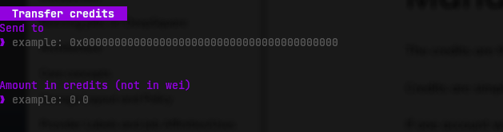

# Managing `credits` and `allowances`

The credits are the units used to allocate resources.

Credits are simple ERC20 tokens, they can be transfered from one account to another.

If one account wish to pull tokens from an other account, it must ask for an allowance first. DeepSquare uses allowances to be allowed to bill a user once a job is finished. When submitting a job, the user agree to allocate some credits. This is the **allowance**. It is also possible to set the allowance manually. For security reasons, we recommend that the allowance is set as the lowest as possible (i.e. the allowance must be 0).

## Using as a CLI

**Transferring credits**

Simply run:

```shell
dps credit transfer [command options] <0x recipient address> <amount>
```

The unit of the amount is credits. If you wish to use wei, set the `--wei` flag.

**Getting and Setting the allowance**

To fetch, simply run:

```shell
dps allowance get
```

To set, simply run:

```shell
dps allowance set [command options] <amount>
```

The unit of the amount is credits. If you wish to use wei, set the `--wei` flag.

## Using as a TUI

In the main menu, press <kbd>ctrl</kbd>+<kbd>t</kbd> to open the credit transfer submission form:

<center>



</center>

Just press <kbd>enter</kbd> to submit the transfer request.
