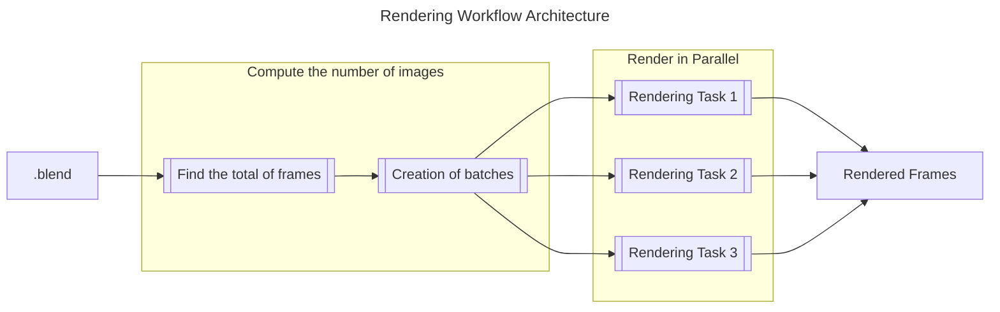

# Blender

DeepSquare integrates [Blender](https://www.blender.org), a 3D computer graphics software tool set used for creating animated films, visual effects, art and 3D models.

This guide presents how we designed and implmented the workflow to execute Blender on the DeepSquare Grid.

## Design

We designed the workflow as follows:

- The rendering task will be divided into several parallel tasks.
- The output will be images or video.

The docker image is already compiled from [github.com/linuxserver/docker-blender](https://github.com/linuxserver/docker-blender) and is exported as `docker.io/linuxserver/blender`.

The steps are as follows:

1. Calculate the total number of frames and distribute the frames evenly.

2. Render the frames in parallel.

3. Combine the frames or videos.



## Implementation

Let's start with the input, output and resources.

### Resource allocation, environment variable and input/output

We will use 4 parallel tasks. Each task has 8 CPUs, 8 GB of RAM, 1 GPU.

```yaml
enableLogging: true
resources:
  tasks: 4
  cpusPerTask: 8
  memPerCpu: 8000
  gpus: 4
input:
  s3:
    region: region
    bucketUrl: s3://test
    path: '/test'
    accessKeyId: accessKeyId
    secretAccessKey: secretAccessKey
    endpointUrl: https://example
output:
  s3:
    region: region
    bucketUrl: s3://test
    path: '/test'
    accessKeyId: accessKeyId
    secretAccessKey: secretAccessKey
    endpointUrl: https://example
continuousOutputSync: true
```

### 1. Compute the number of frames

Let's implement the first step:

```yaml
steps:
  - name: compute-frames
    run:
      container:
        deepsquareHosted: true
        apptainer: true
        image: 'linuxserver/blender:3.4.1'
        registry: registry-1.docker.io
      command: |-
        set -e

        /usr/bin/cat << END > ./frames_per_task.py
        import bpy
        import math
        scene = bpy.context.scene
        frames_per_task = int(math.ceil((scene.frame_end - scene.frame_start + 1)/float($NTASKS)))
        print(f"frames_per_task={frames_per_task}")
        END

        /usr/bin/cat << 'END' > ./start_frame.py
        import bpy
        print(f"start_frame={bpy.context.scene.frame_start}")
        END

        /usr/bin/cat << 'END' > ./end_frame.py
        import bpy
        print(f"end_frame={bpy.context.scene.frame_end}")
        END
        frames_per_task=$(/usr/bin/blender -b "$DEEPSQUARE_INPUT/"*.blend -P ./frames_per_task.py | sed -nr 's/frames_per_task=(.*)/\1/p')
        start_frame=$(/usr/bin/blender -b "$DEEPSQUARE_INPUT/"*.blend -P ./start_frame.py | sed -nr 's/start_frame=(.*)/\1/p')
        end_frame=$(/usr/bin/blender -b "$DEEPSQUARE_INPUT/"*.blend -P ./end_frame.py | sed -nr 's/end_frame=(.*)/\1/p')
        /usr/bin/echo "START_FRAME=$start_frame" >> "$DEEPSQUARE_ENV"
        /usr/bin/echo "END_FRAME=$end_frame" >> "$DEEPSQUARE_ENV"
        /usr/bin/echo "FRAMES_PER_TASK=$frames_per_task" >> "$DEEPSQUARE_ENV"
```

1. We use `file -i` which displays the MIME type, and filters out all files that are not videos or images.
2. We extract and store the images in the `input_frames` directory.
3. Finally, we calculate the number of images and distribute them to the tasks.

### 2. Render the frames

Let's implement the second step. We need to launch multiple substeps in parallel. We can use the `for` directive, and the variable `$index` to select the corresponding frames:

```yaml
steps:
  # ...
  - name: render-loop
    for:
      parallel: true
      range:
        begin: 1
        end: 4
      steps:
        - name: render
          run:
            resources:
              gpusPerTask: 1
            container:
              deepsquareHosted: true
              apptainer: true
              image: 'linuxserver/blender:3.4.1'
              registry: registry-1.docker.io
            shell: /bin/bash
            command: |-
              set -e

              start_frame_i=$(((index-1)*FRAMES_PER_TASK+START_FRAME))
              end_frame_i=$((index*FRAMES_PER_TASK+START_FRAME-1))

              if [[ index -eq $NTASKS ]]; then
                end_frame_i=$END_FRAME
              fi

              echo "Rendering $start_frame_i...$end_frame_i"

              /usr/bin/blender --enable-autoexec -E "CYCLES" -b "$STORAGE_PATH"/input/*.blend -F "OPEN_EXR" -o "$DEEPSQUARE_OUTPUT/frame_#####" -s "$start_frame_i" -e "$end_frame_i" -a -- --cycles-print-stats --cycles-device OPTIX
```

## Conclusion

<details>

<summary>Complete Workflow</summary>

```yaml
enableLogging: true
resources:
  tasks: 4
  cpusPerTask: 8
  memPerCpu: 8000
  gpusPerTask: 1
input:
  s3:
    region: region
    bucketUrl: s3://test
    path: '/test'
    accessKeyId: accessKeyId
    secretAccessKey: secretAccessKey
    endpointUrl: https://example
output:
  s3:
    region: region
    bucketUrl: s3://test
    path: '/test'
    accessKeyId: accessKeyId
    secretAccessKey: secretAccessKey
    endpointUrl: https://example
continuousOutputSync: true
steps:
  - name: compute-frames
    run:
      container:
        deepsquareHosted: true
        apptainer: true
        image: 'linuxserver/blender:3.4.1'
        registry: registry-1.docker.io
      command: |-
        set -e

        /usr/bin/cat << END > ./frames_per_task.py
        import bpy
        import math
        scene = bpy.context.scene
        frames_per_task = int(math.ceil((scene.frame_end - scene.frame_start + 1)/float($NTASKS)))
        print(f"frames_per_task={frames_per_task}")
        END

        /usr/bin/cat << 'END' > ./start_frame.py
        import bpy
        print(f"start_frame={bpy.context.scene.frame_start}")
        END

        /usr/bin/cat << 'END' > ./end_frame.py
        import bpy
        print(f"end_frame={bpy.context.scene.frame_end}")
        END
        frames_per_task=$(/usr/bin/blender -b "$DEEPSQUARE_INPUT/"*.blend -P ./frames_per_task.py | sed -nr 's/frames_per_task=(.*)/\1/p')
        start_frame=$(/usr/bin/blender -b "$DEEPSQUARE_INPUT/"*.blend -P ./start_frame.py | sed -nr 's/start_frame=(.*)/\1/p')
        end_frame=$(/usr/bin/blender -b "$DEEPSQUARE_INPUT/"*.blend -P ./end_frame.py | sed -nr 's/end_frame=(.*)/\1/p')
        /usr/bin/echo "START_FRAME=$start_frame" >> "$DEEPSQUARE_ENV"
        /usr/bin/echo "END_FRAME=$end_frame" >> "$DEEPSQUARE_ENV"
        /usr/bin/echo "FRAMES_PER_TASK=$frames_per_task" >> "$DEEPSQUARE_ENV"
  - name: render-loop
    for:
      parallel: true
      range:
        begin: 1
        end: 4
      steps:
        - name: render
          run:
            container:
              deepsquareHosted: true
              apptainer: true
              image: 'linuxserver/blender:3.4.1'
              registry: registry-1.docker.io
            shell: /bin/bash
            command: |-
              set -e

              start_frame_i=$(((index-1)*FRAMES_PER_TASK+START_FRAME))
              end_frame_i=$((index*FRAMES_PER_TASK+START_FRAME-1))

              if [[ index -eq $NTASKS ]]; then
                end_frame_i=$END_FRAME
              fi

              echo "Rendering $start_frame_i...$end_frame_i"

              /usr/bin/blender --enable-autoexec -E "CYCLES" -b "$STORAGE_PATH"/input/*.blend -F "OPEN_EXR" -o "$DEEPSQUARE_OUTPUT/frame_#####" -s "$start_frame_i" -e "$end_frame_i" -a -- --cycles-print-stats --cycles-device OPTIX
```

</details>
