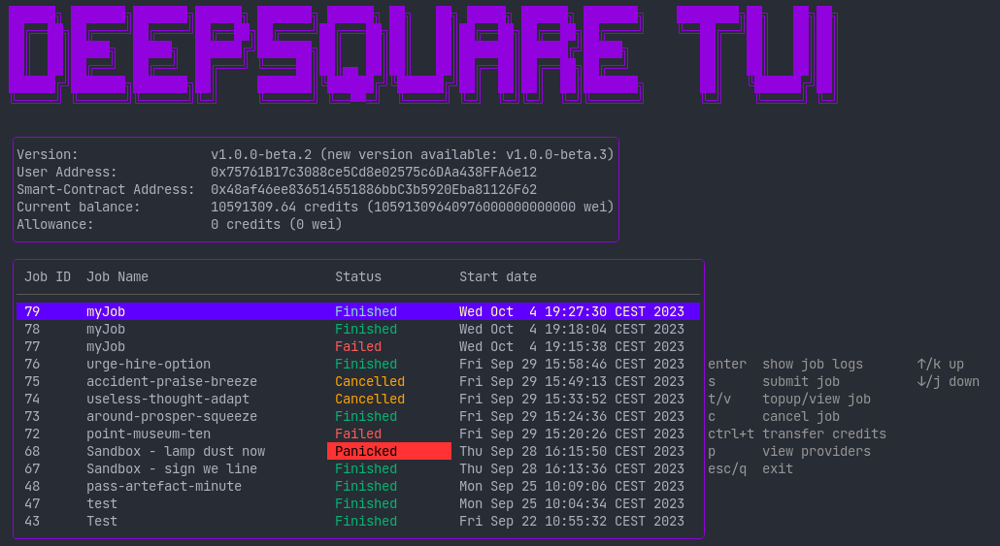

# Go

The Go version of the SDK takes shape as a powerful command-line interface (CLI) and library at the same time. Whether you are building an application that launches workflows, or you are implementing a bot, the DeepSquare Go SDK provides you with the tools and flexibility needed to develop software using the DeepSquare Grid.

## Getting started

### As a CLI

The CLI can be downloaded in the [Releases](https://github.com/deepsquare-io/grid/releases) tab in the Git repository. See [The Command Line Interface - Getting Started](https://docs.deepsquare.run/workflow/cli/getting-started).

**CLI mode**

Run `dps --help` to get the usage of the CLI.

For example, to submit jobs:

1. Run `dps init` to initialize a workflow file.

2. Edit the `job.<...>.yaml`:

   ```yaml title="job.<...>.yaml"
   # yaml-language-server: $schema=/tmp/.job.schema.json
   ## See: https://docs.deepsquare.run/workflow/workflow-api-reference/job

   ## Allow DeepSquare logging
   enableLogging: true

   ## Allocate resources
   resources:
     tasks: 1
     cpusPerTask: 1
     memPerCpu: 1024
     gpus: 0

   ## The job content
   steps:
     ## The steps of the jobs which are run sequentially.
     - name: 'hello-world'
       run:
         container:
           image: ubuntu:latest
         command: echo "hello world"
   ```

3. Submit the job with:

   ```shell
   ./bin/dps submit --watch --exit-on-job-exit --credits 100 --job-name test job.<...>.yaml
   #   --credits value                Allocated a number of credits. Unit is 1e18. Is a float and is not precise. (default: 0)
   #   --exit-on-job-exit, -e         Exit the job after the job has finished and throw on error. (default: false)
   #   --job-name value               The job name.
   #   --watch, -w                    Watch logs after submitting the job (default: false)

   ```

**Interactive mode**

Simply run `dps` to start the Terminal User Interface (TUI) and interactively send jobs.



### As a library

Fetch the library by running:

```shell
go get github.com/deepsquare-io/the-grid/cli
```

And use it:

```go
import (
	"github.com/deepsquare-io/grid/cli/deepsquare"
	"github.com/deepsquare-io/grid/cli/sbatch"
	"github.com/ethereum/go-ethereum/crypto"
)

func main() {
	pk, _ := crypto.GenerateKey() // Use a random account.

	client, _ := deepsquare.NewClient(ctx, &deepsquare.ClientConfig{
		MetaschedulerAddress: common.HexToAddress("0x48af46ee836514551886bbC3b5920Eba81126F62"),
		UserPrivateKey:       pk,
	})

	// Set job name
	var jobName [32]byte
	jobNameS := "test"
	copy(jobName[:], jobNameS)

	// Set allowance
	lockedAmount, _ := new(big.Int).SetString("100000000000000000000", 10)
	curr, err := client.GetAllowance(ctx)
	if err != nil {
		log.Fatalln(err.Error())
	}
	err = client.SetAllowance(ctx, curr.Add(curr, lockedAmount))
	if err != nil {
		log.Fatalln(err.Error())
	}

	// Submit job
	_, _ = client.SubmitJob(
		context.TODO(),
		&sbatch.Job{
			Resources: &sbatch.JobResources{
				Tasks:       1,
				CPUsPerTask: 1,
				MemPerCPU:   100,
				GPUs: 0,
			},
			Steps: []*sbatch.Step{
				{
					Run: &sbatch.StepRun{
						Command: "echo test",
					},
				},
			},
		},
		lockedAmount,
		jobName,
	)

	// ...
}
```

See references for more examples.

## References

The source code of the CLI is accessible on the Git repository [github.com/deepsquare-io/grid/cli](https://github.com/deepsquare-io/grid/tree/main/cli).

Examples of usage as an SDK are available in the [`_examples` directory](https://github.com/deepsquare-io/grid/tree/main/cli/_examples).

Official API documentation is available on the [pkg.go.dev website](https://pkg.go.dev/github.com/deepsquare-io/grid/cli).

## Contributing

Everyone is welcome to contribute code via [pull requests](https://github.com/deepsquare-io/grid/pulls), to file [issues](https://github.com/deepsquare-io/grid/issues) on GitHub, to help triage, reproduce, or fix bugs that people have filed, to add to our documentation, or to help out in any other way.
