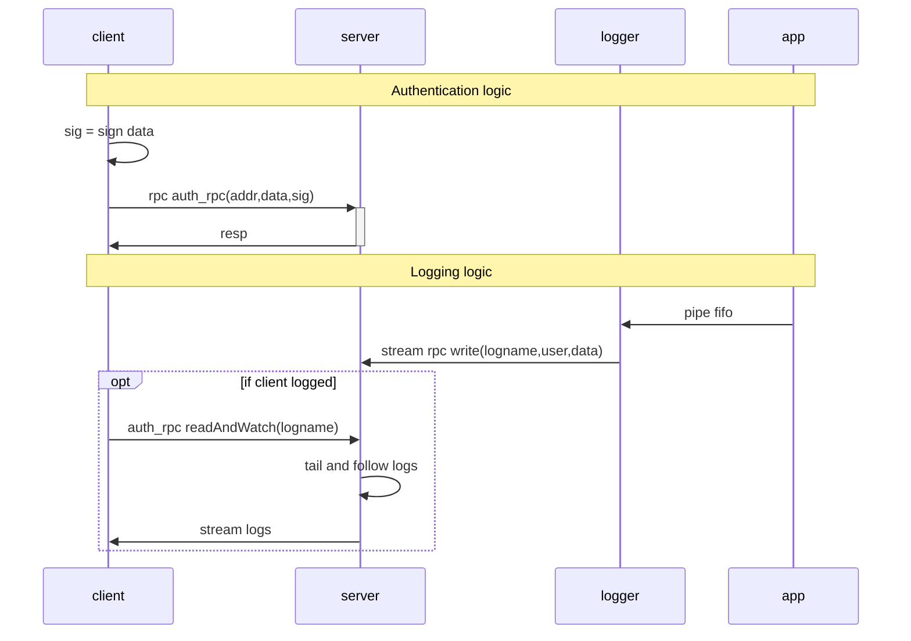

# grid-logger

POC of a logger with Web3 authentication.

# Logic

```mermaid
sequenceDiagram
    participant client
    participant server
    participant logger
    participant app
    Note over client,app: Authentication logic
    client->>client: sig = sign data
    client->>+server: rpc auth_rpc(addr,data,sig)
    server->>-client: resp

    Note over client,app: Logging logic
    app->>logger: pipe fifo
    logger->>server: stream rpc write(logname,user,data)
    opt if client logged
        client->>server: auth_rpc readAndWatch(logname)
        server->>server: tail and follow logs
        server->>client: stream logs
    end


```
