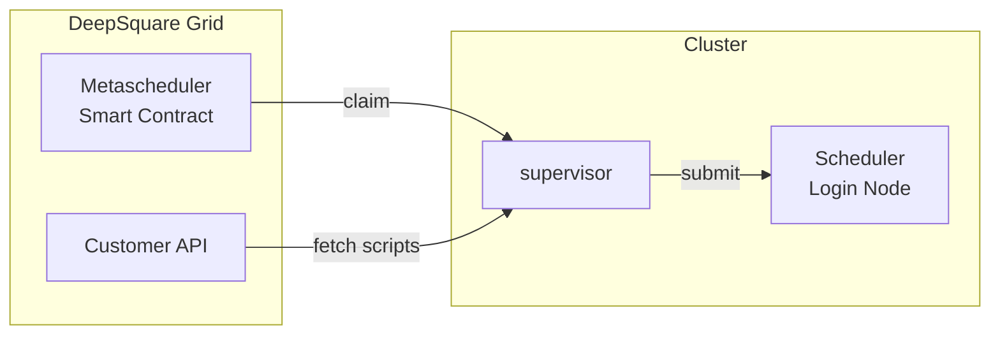

# Deepsquare Grid Supervisor

The middleman between the job scheduler and the DeepSquare Meta-scheduler.



## Usage

### Summary

```shell
NAME:
   supervisor - Overwatch the job scheduling and register the compute to the Deepsquare Grid.

USAGE:
   supervisor command [command options] [arguments...]

COMMANDS:
   help, h  Shows a list of commands or help for one command

OPTIONS:
   --grpc.listen-address value                Address to listen on. Is used for receiving job status via the job completion plugin. (default: ":3000") [$LISTEN_ADDRESS]
   --tls                                      Enable TLS for GRPC. (default: false) [$TLS_ENABLE]
   --tls.key-file value                       TLS Private Key file. [$TLS_KEY]
   --tls.cert-file value                      TLS Certificate file. [$TLS_CERT]
   --metascheduler.endpoint value             Metascheduler RPC endpoint. (default: "https://testnet.deepsquare.run/rpc") [$METASCHEDULER_ENDPOINT]
   --customer.endpoint value                  Oracle gRPC endpoint. (default: "127.0.0.1:443") [$CUSTOMER_ENDPOINT]
   --customer.tls                             Enable TLS for the Customer API. (default: true) [$CUSTOMER_TLS_ENABLE]
   --customer.tls.insecure                    Skip TLS verification. By enabling it, customer.tls.ca and customer.tls.server-host-override are ignored. (default: false) [$CUSTOMER_TLS_INSECURE]
   --customer.tls.ca value                    Path to CA certificate for TLS verification. [$CUSTOMER_CA]
   --customer.tls.server-host-override value  The server name used to verify the hostname returned by the TLS handshake. (default: "customer.deepsquare.io") [$CUSTOMER_SERVER_HOST_OVERRIDE]
   --metascheduler.smart-contract value       Metascheduler smart-contract address. (default: "0x") [$METASCHEDULER_SMART_CONTRACT]
   --eth.private-key value                    An hexadecimal private key for ethereum transactions. [$ETH_PRIVATE_KEY]
   --slurm.ssh.address value                  Address of the Slurm login node. [$SLURM_SSH_ADDRESS]
   --slurm.ssh.admin-user scontrol            SLURM admin user used for calling scontrol commands. [$SLURM_SSH_ADMIN_USER]
   --slurm.ssh.private-key value              Base64-encoded one line SSH private key used for impersonation. The public key must be inserted in the authorized_keys file of each user. [$SLURM_SSH_PRIVATE_KEY]
   --slurm.batch value                        Server-side SLURM sbatch path. (default: "/usr/bin/sbatch") [$SLURM_SBATCH_PATH]
   --slurm.cancel value                       Server-side SLURM scancel path. (default: "/usr/bin/scancel") [$SLURM_SCANCEL_PATH]
   --slurm.squeue value                       Server-side SLURM squeue path. (default: "/usr/bin/ssqueue") [$SLURM_SQUEUE_PATH]
   --slurm.control value                      Server-side SLURM scontrol path. (default: "/usr/bin/scontrol") [$SLURM_SCONTROL_PATH]
   --res.nodes scontrol show partitions       Total number of Nodes reported by scontrol show partitions (default: 0) [$TOTAL_NODES]
   --res.cpus scontrol show partitions        Total number of CPUs reported by scontrol show partitions (default: 0) [$TOTAL_CPUS]
   --res.gpus scontrol show partitions        Total number of GPUs reported by scontrol show partitions (default: 0) [$TOTAL_GPUS]
   --res.mem scontrol show partitions         Total number of Memory (MB) reported by scontrol show partitions (default: 0) [$TOTAL_MEMORY]
   --help, -h                                 show help (default: false)
```

### Detailed configuration

#### gRPC server configuration

It is necessary to run the server with TLS. Either use a reverse proxy or add the certificates using the flags:

```shell
   --tls                                      Enable TLS for GRPC. (default: false) [$TLS_ENABLE]
   --tls.key-file value                       TLS Private Key file. [$TLS_KEY]
   --tls.cert-file value                      TLS Certificate file. [$TLS_CERT]
```

Configure the port with:

```shell
   --grpc.listen-address value                Address to listen on. Is used for receiving job status via the job completion plugin. (default: ":3000") [$LISTEN_ADDRESS]
```

#### Customer API configuration

The Customer API should already be in TLS with common root CA. If that's not the case, add the CA certificate of the customer API using

```shell
   --customer.tls.ca value                    Path to CA certificate for TLS verification. [$CUSTOMER_CA]
   --customer.tls.server-host-override value  The server name used to verify the hostname returned by the TLS handshake. (default: "customer.deepsquare.io") [$CUSTOMER_SERVER_HOST_OVERRIDE]
```

Or enable insecure mode (no TLS verification):

```shell
   --customer.tls.insecure                    Skip TLS verification. By enabling it, customer.tls.ca and customer.tls.server-host-override are ignored. (default: false) [$CUSTOMER_TLS_INSECURE]

```

Configure the Customer API endpoint with:

```shell
   --customer.endpoint value                  Oracle gRPC endpoint. (default: "127.0.0.1:443") [$CUSTOMER_ENDPOINT]
```

#### Metascheduler configuration

Configure the network RPC URL with:

```shell
   --metascheduler.endpoint value             Metascheduler RPC endpoint. (default: "https://testnet.deepsquare.run/rpc") [$METASCHEDULER_ENDPOINT]
```

Set the smart contract address with:

```shell
   --metascheduler.smart-contract value       Metascheduler smart-contract address. (default: "0x") [$METASCHEDULER_SMART_CONTRACT]
```

Configure the nethereum private key, which will be used for RPC calls and rewards:

```shell
   --eth.private-key value                    An hexadecimal private key for ethereum transactions. [$ETH_PRIVATE_KEY]
```

#### Slurm configuration

##### SSH access

The supervisor expect SSH access to a SLURM login node.

```shell
   --slurm.ssh.address value                  Address of the Slurm login node. [$SLURM_SSH_ADDRESS]
   --slurm.ssh.admin-user scontrol            SLURM admin user used for calling scontrol commands. [$SLURM_SSH_ADMIN_USER]
   --slurm.ssh.private-key value              Base64-encoded one line SSH private key used for impersonation. The public key must be inserted in the authorized_keys file of each user. [$SLURM_SSH_PRIVATE_KEY]
```

Use the [`provider-ssh-authorized-keys`](https://github.com/deepsquare-io/the-grid/tree/main/provider-ssh-authorized-keys) to configure the SSH server on the login nodes.

##### Cluster configuration

```shell
   --res.nodes scontrol show partitions       Total number of Nodes reported by scontrol show partitions (default: 0) [$TOTAL_NODES]
   --res.cpus scontrol show partitions        Total number of CPUs reported by scontrol show partitions (default: 0) [$TOTAL_CPUS]
   --res.gpus scontrol show partitions        Total number of GPUs reported by scontrol show partitions (default: 0) [$TOTAL_GPUS]
   --res.mem scontrol show partitions         Total number of Memory (MB) reported by scontrol show partitions (default: 0) [$TOTAL_MEMORY]
```

## Docker

You can pull the image with:

```shell
docker pull ghcr.io/deepsquare-io/supervisor:<version>
```

More details [here](https://github.com/deepsquare-io/the-grid/pkgs/container/supervisor).

## Build

The `main` function is stored in the `cmd` package. To build the supervisor, do:

```shell
CGO_ENABLED=0 GOOS=linux GOARCH=amd64 go build -a -o app ./cmd
```
